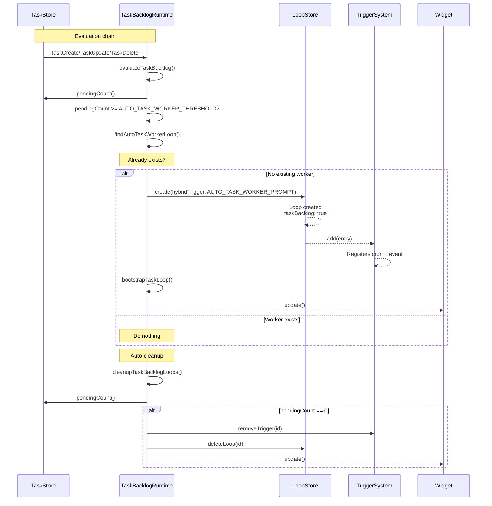
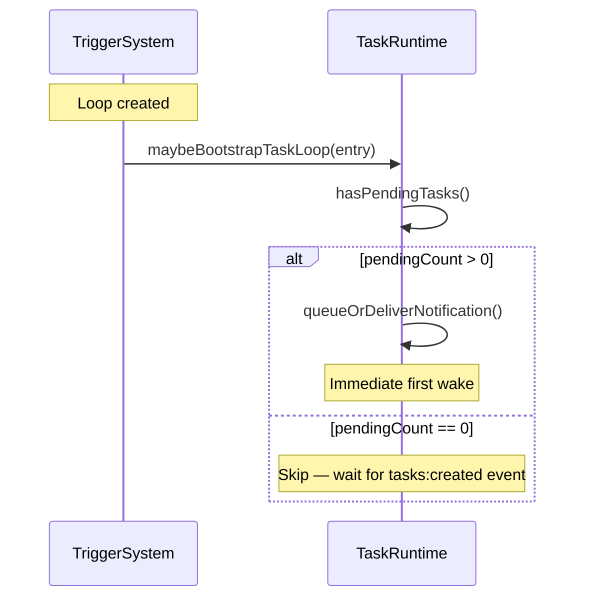
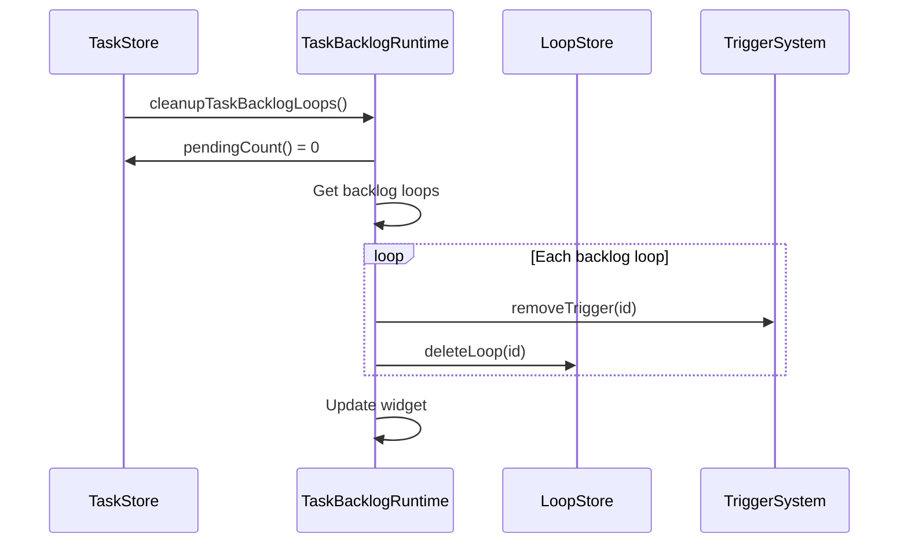

# Auto Task Worker Loop

## When to Use

Automatically created when the pending task count reaches a threshold. The system manages this without user interaction — it's an internal workflow triggered by the backlog evaluation.

## Trigger Condition

When `pendingCount >= 5`, an auto task worker loop is created.

```typescript
// src/runtime/task-backlog-runtime.ts
const AUTO_TASK_WORKER_THRESHOLD = 5;

const AUTO_TASK_WORKER_PROMPT = 
  "Run TaskList, pick next pending task, mark it in_progress, implement it, " +
  "run validation, complete it. If no pending tasks remain, " +
  "call LoopDelete on your own loop ID.";
```

## Workflow Diagram



## Loop Properties

| Property | Value |
|----------|-------|
| `trigger.type` | `hybrid` |
| `trigger.cron` | `*/5 * * * *` |
| `trigger.event.source` | `tasks:created` |
| `trigger.debounceMs` | `30000` |
| `prompt` | `AUTO_TASK_WORKER_PROMPT` |
| `recurring` | `true` |
| `taskBacklog` | `true` |
| `maxFires` | `30` |

## Bootstrap Behavior

When the loop is created and there are already pending tasks:



## Auto-Cleanup

When `cleanupTaskBacklogLoops()` is called and `pendingCount === 0`:



## Cron Timing

The auto task worker loop is a **hybrid** loop — it fires on BOTH a cron schedule AND `tasks:created` events. See [Cron Scheduler](./cron-scheduler.md) for the full timing model.

| Property | Value |
|----------|-------|
| Cron schedule | `*/5 * * * *` (every 5 minutes) |
| Event trigger | `tasks:created` |
| Debounce | 30 seconds |
| Jitter applied | Yes (deterministic, up to 2.5 minutes) |
| Fires per 5-min window | At most 1 (debounce prevents duplicates) |

## Relevant Files

| File | Purpose |
|------|---------|
| `src/runtime/task-backlog-runtime.ts` | Auto task worker creation/cleanup |
| `src/runtime/task-rpc.ts` | pi-tasks RPC bridge |
| `src/tools/native-task-tools.ts` | evaluateTaskBacklog() calls |

## Related Flows

- [Task Create](./task-create.md)
- [Task Update](./task-update.md)
- [Loop Create — Hybrid Trigger](./loop-create-hybrid.md)
- [Session Lifecycle](./session-lifecycle.md)
