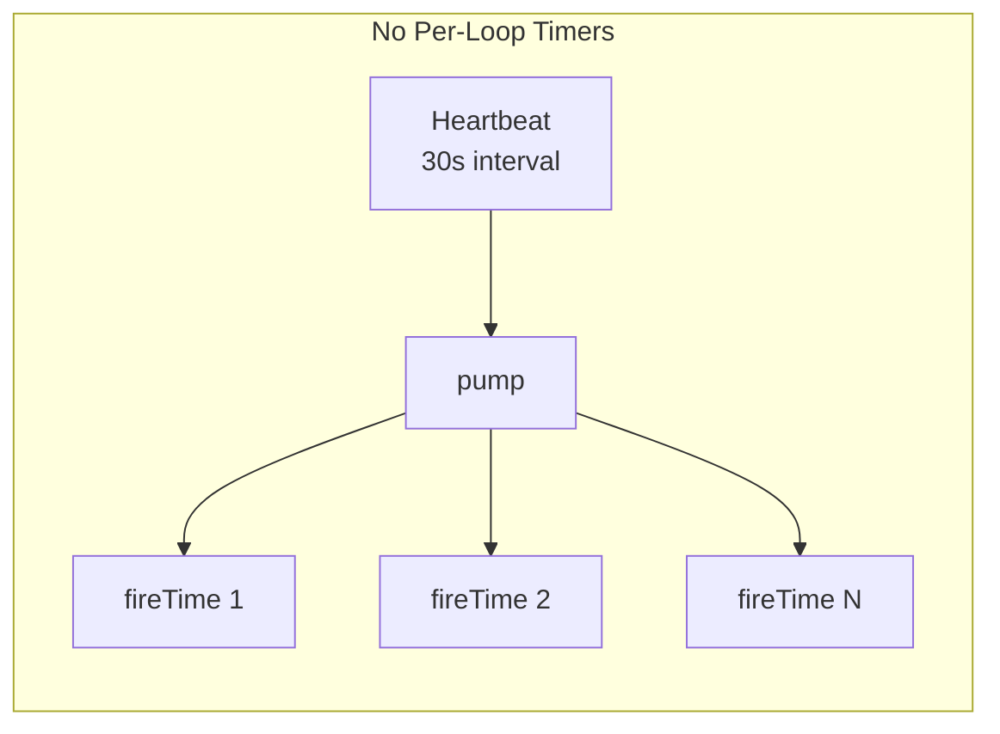
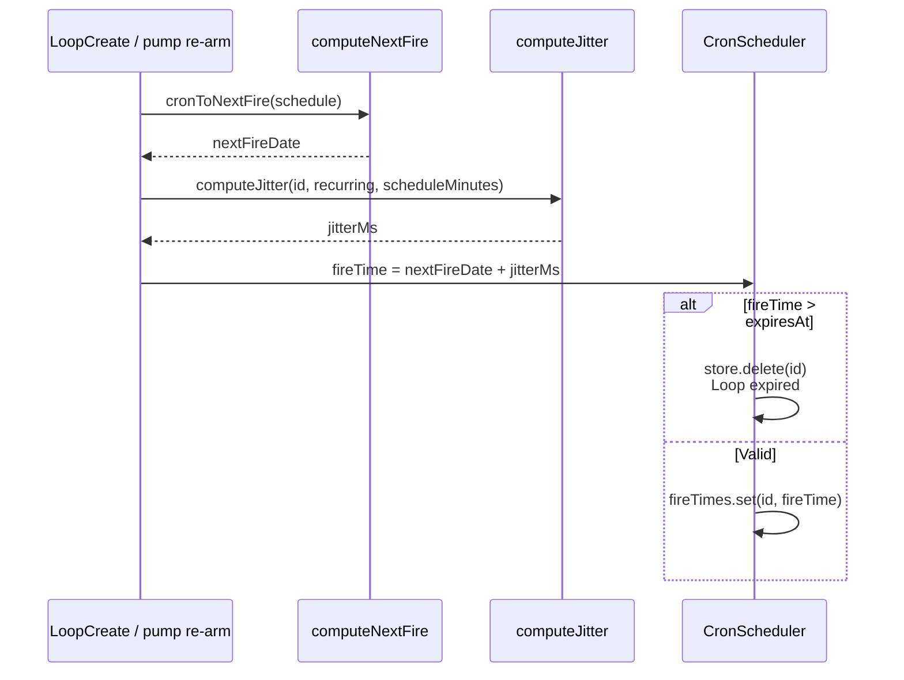
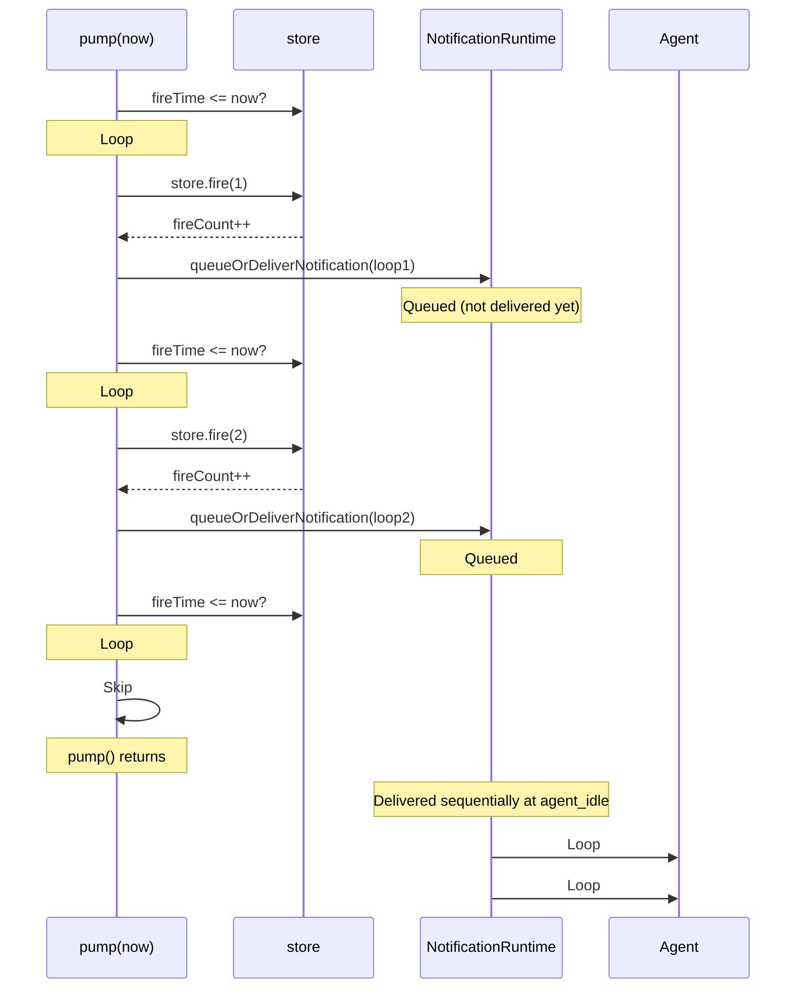
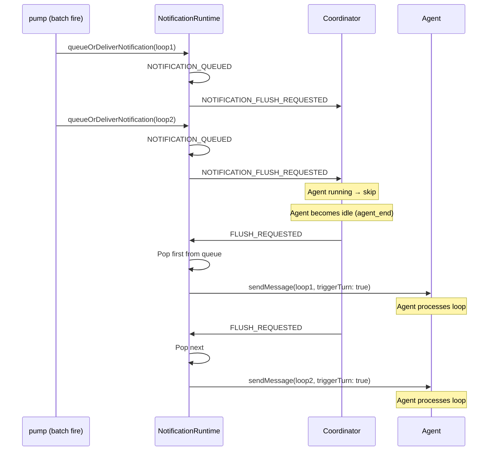
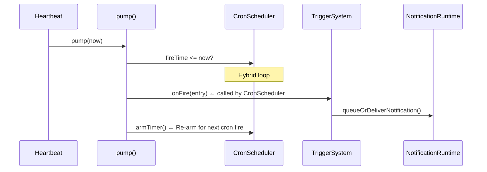
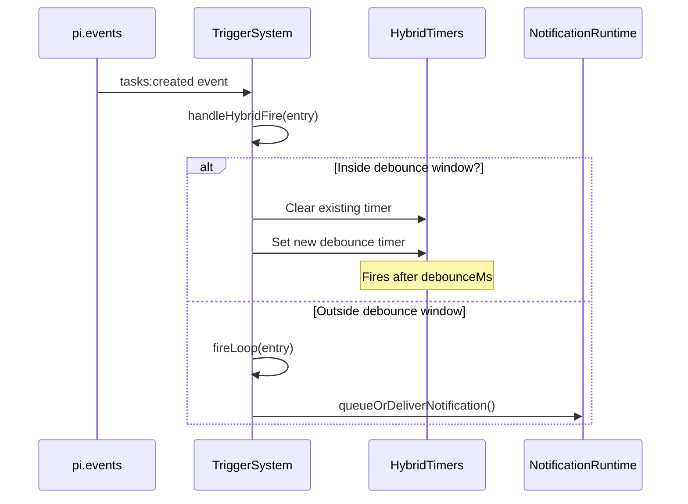
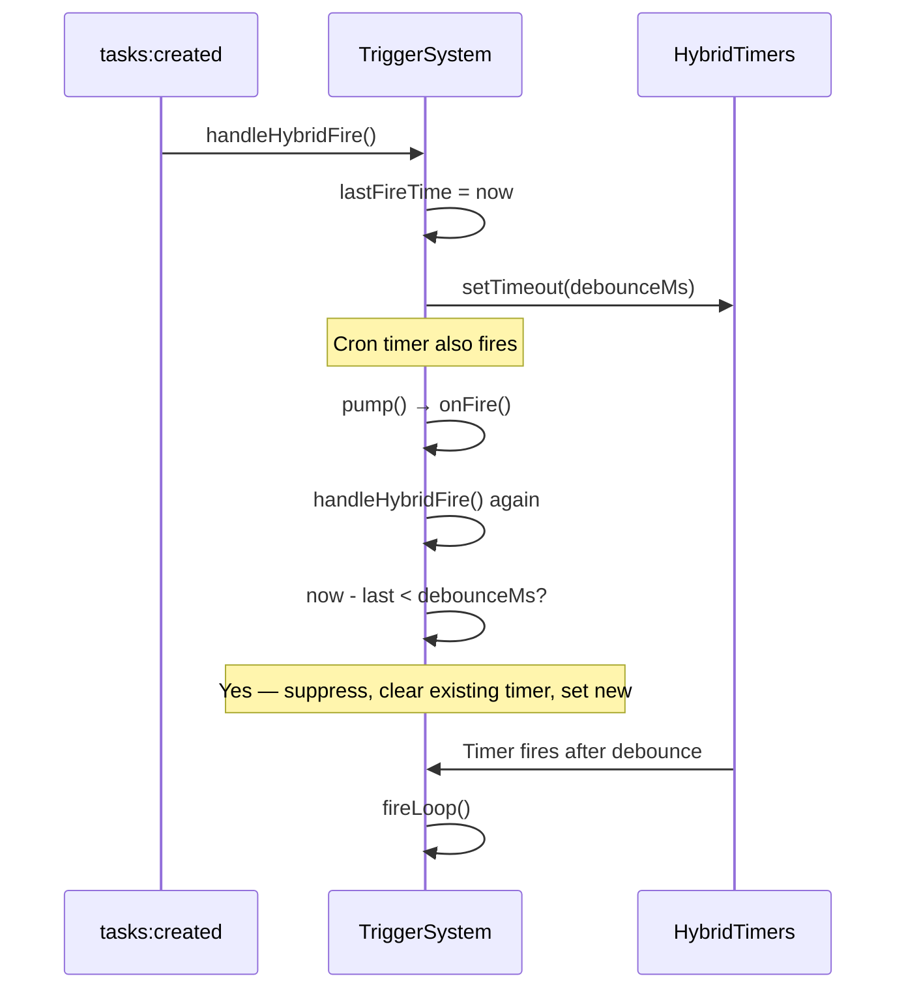
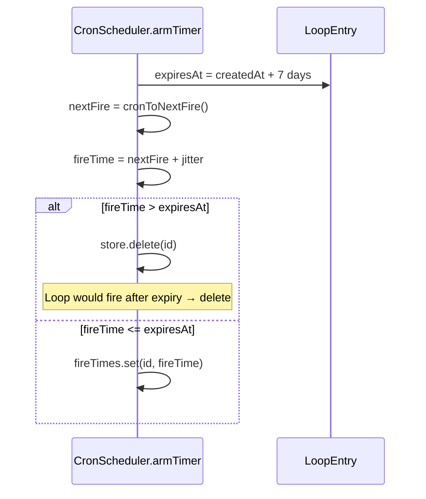
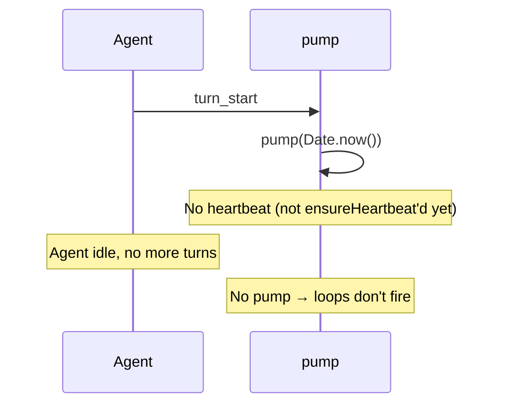
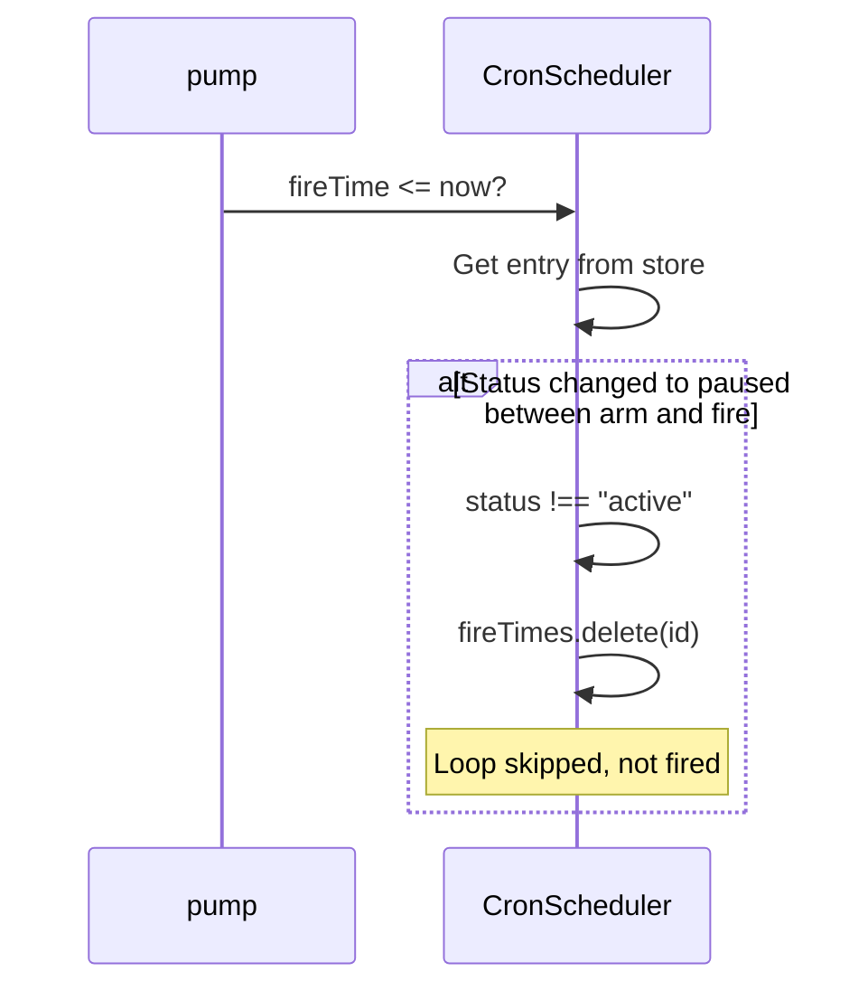

# Cron Scheduler System

## Overview

The cron scheduler is a **pump-driven** system — not a traditional cron with per-loop timers. It uses a single heartbeat interval that checks all loops against their scheduled fire times.



## Key Architecture Decision

**There are NO per-loop `setTimeout` timers.** Instead:

- A single `setInterval` heartbeat fires every 30 seconds
- Each tick calls `scheduler.pump(Date.now())` which iterates all loops
- Any loop whose `fireTime <= now` is fired
- After firing, the next `fireTime` is computed and stored back in `fireTimes` Map

This is intentionally different from traditional cron — it's a **shared tick** model.

## Core Data Structure

```typescript
// src/scheduler.ts
class CronScheduler {
  // Map<loopId, fireTime>
  // fireTime is a Unix timestamp (ms), NOT a Node.js timer
  private fireTimes = new Map<string, number>();
}
```

| Field | Purpose |
|-------|---------|
| `fireTimes` | Stores `loopId → nextFireTimestamp` for all cron/hybrid loops |
| No per-loop timers | All timing driven by `pump()` iteration |

## Fire Time Computation

When a loop is added or re-armed after firing:



### 1. Next Fire Calculation (`cronToNextFire`)

```typescript
// src/loop-parse.ts
function cronToNextFire(cronExpr: string, fromDate: Date = new Date()): Date {
  // Iterates forward minute by minute (up to 1 year)
  // Returns first minute that matches all 5 cron fields
}
```

Cron expression format: `minute hour day month weekday`

| Expression | Meaning |
|------------|---------|
| `* * * * *` | Every minute |
| `*/5 * * * *` | Every 5 minutes |
| `0 */2 * * *` | Every 2 hours (at minute 0) |
| `0 9 * * 1-5` | Weekdays at 9:00 AM |

### 2. Jitter Calculation (`computeJitter`)

Jitter spreads out fires to prevent thundering herd:

```typescript
// src/loop-parse.ts
function computeJitter(taskId: string, recurring: boolean, scheduleMinutes: number): number {
  const hash = hashString(taskId);
  const normalized = Math.abs(hash % 10000) / 10000;

  if (recurring && scheduleMinutes <= 30) {
    // Up to half the interval
    return normalized * (scheduleMinutes / 2) * 60 * 1000;
  }
  if (recurring) {
    // Up to 30 minutes
    return normalized * 30 * 60 * 1000;
  }
  // One-shot: up to 90 seconds
  return normalized * 90 * 1000;
}
```

| Schedule | Max Jitter |
|----------|------------|
| `*/1 * * * *` (1 min) | 30 seconds |
| `*/5 * * * *` (5 min) | 2.5 minutes |
| `*/30 * * * *` (30 min) | 15 minutes |
| `0 */2 * * *` (2 hours) | 30 minutes |
| One-shot | 90 seconds |

**Example**: Two loops with `*/5 * * * *` scheduled for 10:00 will fire at slightly different times within a ~2.5 minute window based on their loop IDs.

## The Pump Cycle

`pump()` is called by three sources:

```mermaid
flowchart TD
    A[turn_start] --> P[pump]
    B[agent_end] --> P
    C[Heartbeat 30s] --> P

    P --> L[pumpLoops]
    L --> F{Filter: autoTask loops<br/>with no pending tasks?}

    F -->|Mark skipped| M[pendingTasks Map]
    F -->|Skip due autoTask with 0 pending| M
    F -->|All others| P2[scheduler.pump]

    P2 --> I1{Loop 1 due?}
    P2 --> I2{Loop 2 due?}
    P2 --> IN{Loop N due?}

    I1 -->|Yes| S1[store.fire(id)]
    I2 -->|Yes| S2[store.fire(id)]
    IN -->|Yes| SN[store.fire(id)]

    S1 --> O1[onLoopFire]
    S2 --> O2[onLoopFire]
    SN --> ON[onLoopFire]
```

### pump() Implementation

```typescript
// src/scheduler.ts
pump(now: number, filter?: (entry: LoopEntry) => boolean): void {
  for (const [id, fireTime] of this.fireTimes) {
    if (now < fireTime) continue;  // Not due yet

    const entry = this.store.get(id);
    if (!entry || entry.status !== "active") {
      this.fireTimes.delete(id);  // Clean up stale
      continue;
    }

    if (filter && !filter(entry)) continue;  // Filtered out

    if (now >= entry.expiresAt) {
      this.store.delete(id);       // BUG: no triggerSystem.remove()
      this.fireTimes.delete(id);
      continue;
    }

    this.onFire(entry);           // ← Fires the loop

    const fresh = this.store.get(id);
    if (!fresh) { this.fireTimes.delete(id); continue; }

    if (fresh.recurring && atMaxFires(fresh)) {
      this.store.delete(id);
      this.fireTimes.delete(id);
      continue;
    }

    if (fresh.recurring) {
      this.armTimer(fresh);      // Re-arm for next fire
    } else {
      this.fireTimes.delete(id);  // One-shot: remove
    }
  }
}
```

## Concurrency: Multiple Loops Firing Simultaneously

### Yes, Multiple Loops Can Fire at Once

When `pump()` iterates through `fireTimes`, it fires ALL loops that are due in a single synchronous loop:



### Delivery Order: Sequential, Not Parallel

Notifications are queued individually but delivered one-by-one when the agent becomes idle:



**Key point**: Fires are batched in a single `pump()` call, but agent wakes are **sequential**. The agent processes one loop wake at a time.

### Jitter Prevents True Simultaneity

Even if two loops have the same cron schedule, jitter ensures they don't share the exact same `fireTime`:

```typescript
// Two loops: both */5 * * * *
fireTimes.set("1", 1749000000000);  // +0ms jitter
fireTimes.set("2", 1749000150000);  // +150000ms jitter (2.5 min)
```

In the same 30s heartbeat window, the scheduler fires both (if both `fireTime <= now`). They're fired in `fireTimes` iteration order (insertion order).

## Hybrid Loop Firing

Hybrid loops have **two fire paths**:

### Path 1: Cron Fire (via pump)



### Path 2: Event Fire (via TriggerSystem)



### Hybrid Debounce

When both cron and event fire the same loop within the debounce window:



**Important**: The cron fire calls `onFire()` (through `pump()`) but the event fire's debounce prevents duplicate delivery. The debounce uses `lastFireTime` to track the most recent fire and cancels pending timers.

## 7-Day Expiry

Loops automatically expire after 7 days:



| Scenario | Behavior |
|----------|----------|
| Cron schedules fire beyond 7 days | Loop deleted immediately on arm |
| Cron schedules fire within 7 days | Fires normally, then deleted |

## Edge Cases

### 1. Agent Idle, No Heartbeat

If the agent is completely idle with no heartbeat timer running:



The heartbeat (`ensureHeartbeat()`) is only started on `turn_start`, `before_agent_start`, or `showPersistedLoops()`. If the agent never starts a new turn, the heartbeat may not be running. However, once started, it keeps running.

### 2. Loop Paused During Fire



### 3. Recurring Loop Firing Rapidly

If a loop's cron schedule is very frequent (e.g., `* * * * *` every minute) and the heartbeat runs every 30 seconds:

```
0:00  Loop created, fireTime = 0:01
0:30  pump → fires loop, armTimer → fireTime = 0:02
0:32  pump → fires loop, armTimer → fireTime = 0:03
...
```

The loop fires twice per minute (heartbeat cadence). The 30s heartbeat is the limiting factor.

### 4. pump() Re-entrancy

`pump()` is called synchronously from multiple places:

```typescript
// All call pump synchronously (in order):
turn_start     → pumpLoops() → scheduler.pump()
agent_end      → pumpLoops() → scheduler.pump()
heartbeat tick → pumpLoops() → scheduler.pump()
```

If `agent_end` fires during a `pump()` call (nested), the nested `pump()` will iterate `fireTimes` again. Since `fireTimes` is a Map (not iterated by index), already-fired loops won't re-fire because:
- Their `fireTimes` entry was deleted/updated
- Or `now < fireTime` check passes for already-fired ones

**Safe from double-fire**: Once a loop is fired, `armTimer()` sets a new `fireTime` in the future.

## Key Constants

| Constant | Value | Location |
|----------|-------|----------|
| `HEARTBEAT_MS` | 30,000ms (30s) | `src/runtime/session-runtime.ts` |
| `MAX_EXPIRY_DAYS` | 7 days | `src/loop-reducer.ts` |

## Summary Table

| Question | Answer |
|----------|--------|
| Real-time timers per loop? | No — shared tick model |
| How often does it check? | Every 30s via heartbeat + turn boundaries |
| Can multiple loops fire at once? | Yes — pump() fires all due loops synchronously |
| How are notifications delivered? | Sequentially, one at a time at agent idle |
| What prevents thundering herd? | Jitter (deterministic per loop ID) |
| Hybrid loop fires twice? | Once due to debounce suppression |
| How long can loops run? | Up to 7 days, then auto-expire |

## Relevant Files

| File | Role |
|------|------|
| `src/scheduler.ts` | CronScheduler, fireTimes Map, pump(), armTimer() |
| `src/loop-parse.ts` | cronToNextFire(), computeJitter(), COMMON_INTERVALS |
| `src/trigger-system.ts` | Event subscriptions, hybrid debounce, fireLoop() |
| `src/runtime/session-runtime.ts` | 30s heartbeat, pumpLoops(), turn/agent lifecycle |
| `src/runtime/notification-runtime.ts` | Notification queue, sequential delivery |
| `src/index.ts` | onLoopFire(), store.fire(), autoCreateTask() |

## Related Flows

- [Loop Create — Cron Trigger](./loop-create-cron.md)
- [Loop Create — Hybrid Trigger](./loop-create-hybrid.md)
- [Session Lifecycle](./session-lifecycle.md)
- [Auto Task Worker Loop](./auto-task-worker.md)
