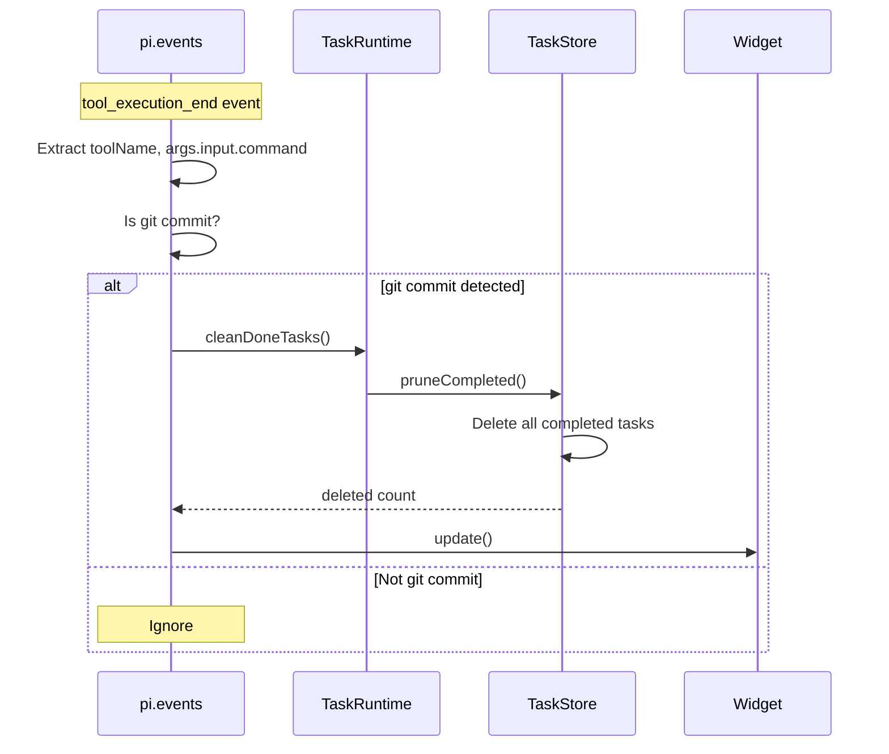

# Git Commit Task Pruning

## When to Use

Automatically triggered when the agent executes a `git commit` command. Completed tasks are pruned from the store as a reward for productive work.

## Workflow Diagram



## Implementation

```typescript
// src/runtime/session-runtime.ts
pi.on("tool_execution_end", async (event: unknown, ctx: ExtensionContext) => {
  const typed = event as {
    toolName?: string;
    isError?: boolean;
    args?: { command?: string };
    input?: { command?: string };
  };

  // Only trigger on successful bash git commits
  if (typed.toolName !== "bash" || typed.isError) return;

  const command = typed.args?.command ?? typed.input?.command;
  if (typeof command !== "string") return;

  // Check for git commit
  if (!/^\s*git\s+commit\b/i.test(command)) return;

  await cleanDoneTasks();
});
```

## Detection Logic

| Condition | Value |
|-----------|-------|
| Tool name | `bash` |
| `isError` | `false` |
| Command pattern | `/^\s*git\s+commit\b/i` |

## Behavior

1. Matches any `git commit` command (with or without flags like `-m`, `-am`, `--amend`)
2. Calls `TaskStore.pruneCompleted()` which deletes ALL tasks with status `completed`
3. Emits `tasks:deleted` events for each deleted task
4. Triggers task backlog evaluation (may create/delete auto task worker loop)

## Limitations

- Only fires for `bash` tool (not other shell tools)
- Does not fire if `isError: true` (failed commits don't prune)
- No way to disable this behavior
- No granular pruning (all completed tasks, not just the one related to the commit)

## Relevant Files

| File | Purpose |
|------|---------|
| `src/runtime/session-runtime.ts` | tool_execution_end handler |
| `src/task-store.ts` | TaskStore.pruneCompleted() |
| `src/runtime/task-rpc.ts` | cleanDoneTasks() → pi-tasks or native |

## Related Flows

- [Auto Task Worker Loop](./auto-task-worker.md)
- [Session Lifecycle](./session-lifecycle.md)
- [Task Delete](./task-delete.md)
