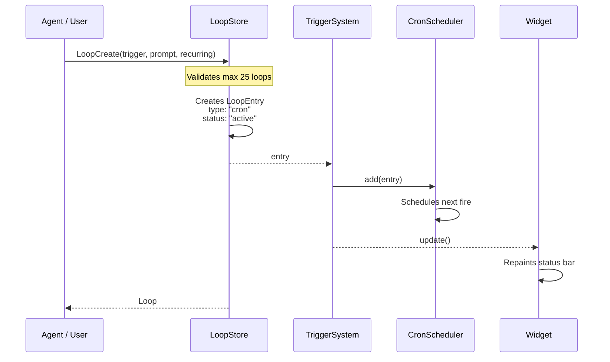

# Loop Create — Cron Trigger

## When to Use

User wants to schedule a recurring check on a time interval (e.g., "every 5 minutes", "every 2 hours").

## Workflow Diagram



## Entry Points

### Via Tool: `LoopCreate`

1. Agent calls `LoopCreate` with:
   - `trigger`: interval string (e.g., `"5m"`, `"2h"`, `"1d"`) or full cron expression
   - `prompt`: what to do when the loop fires
   - `recurring`: `true` (default)
   - `maxFires`: optional safety limit

2. System parses the interval → cron expression via `loop-parse.ts`

3. LoopStore creates a `LoopEntry` with:
   - `{ type: "cron", schedule: parsed.cron }`
   - 7-day expiry
   - Status: `active`

4. TriggerSystem registers the loop with CronScheduler

5. Widget updates to show new loop

6. Response includes loop ID for cancellation reference

### Via Command: `/loop [interval] [prompt]`

1. User types `/loop 5m check the deploy`

2. `loop-command.ts` handler parses: `args = "5m check the deploy"`

3. Regex extracts interval `5m` and prompt `check the deploy`

4. Creates loop via `store.create()` + `triggerSystem.add()`

5. UI notification confirms creation

### Via Command: `/loop` (interactive)

1. User types `/loop` with no args

2. Command shows selection menu:
   - "Create scheduled loop"
   - "Create event-triggered loop"
   - "View loops"
   - "Settings"

3. "Create scheduled loop" → prompts for prompt then interval

4. Same creation flow as above

## Trigger Parsing

| Input | Parsed Cron | Description |
|-------|-------------|-------------|
| `30s` | `*/1 * * * *` | Rounded to 1 minute |
| `5m` | `*/5 * * * *` | Every 5 minutes |
| `2h` | `0 */2 * * *` | Every 2 hours |
| `1d` | `0 0 * * *` | Daily at midnight |
| `0 9 * * 1-5` | `0 9 * * 1-5` | Weekdays at 9am |

## Jitter

To prevent all cron loops from firing simultaneously (thundering herd), each loop adds a random jitter based on its ID:

```typescript
// src/loop-parse.ts
function computeJitter(taskId, recurring, scheduleMinutes): number {
  const hash = hashString(taskId);
  const normalized = Math.abs(hash % 10000) / 10000;

  if (recurring && scheduleMinutes <= 30) {
    // Up to half the interval in ms
    return normalized * (scheduleMinutes / 2) * 60 * 1000;
  }
  if (recurring) {
    // Up to 30 minutes for longer intervals
    return normalized * 30 * 60 * 1000;
  }
  // One-shot: up to 90 seconds
  return normalized * 90 * 1000;
}
```

This means two loops with the same schedule but different IDs will fire at slightly different times. The jitter is deterministic (based on loop ID hash), so it remains consistent across restarts.

## Data Structure

```typescript
// src/types.ts
interface LoopEntry {
  id: string;
  prompt: string;
  trigger: CronTrigger | EventTrigger | HybridTrigger;
  status: "active" | "paused";
  recurring: boolean;
  createdAt: number;      // Unix timestamp
  updatedAt: number;      // Unix timestamp
  expiresAt: number;      // Unix timestamp (createdAt + 7 days)
  autoTask?: boolean;
  taskBacklog?: boolean;
  readOnly?: boolean;
  maxFires?: number;
  fireCount?: number;
}

interface CronTrigger {
  type: "cron";
  schedule: string;  // e.g., "*/5 * * * *"
}
```

## Safety Options

| Option | Purpose | Example |
|--------|---------|---------|
| `maxFires` | Auto-delete after N fires | `maxFires: 10` |
| `readOnly` | Restrict to read-only tools | `readOnly: true` |
| `recurring` | Repeat or one-shot | `recurring: false` |

## Exit Conditions

1. Loop fires when cron schedule matches current time
2. Agent receives wake prompt via `pi.sendMessage()`
3. Loop increments `fireCount`
4. If `fireCount >= maxFires`: loop auto-deleted

## Relevant Files

| File | Purpose |
|------|---------|
| `src/types.ts` | LoopEntry, CronTrigger data structures |
| `src/store.ts` | LoopStore.create() persistence |
| `src/loop-parse.ts` | Interval string → cron expression parsing |
| `src/scheduler.ts` | CronScheduler for timer management |
| `src/trigger-system.ts` | Trigger registration and management |
| `src/tools/loop-tools.ts` | LoopCreate tool implementation |
| `src/commands/loop-command.ts` | /loop command handler |

## Related Flows

- [Loop Create — Event Trigger](./loop-create-event.md)
- [Loop Create — Hybrid Trigger](./loop-create-hybrid.md)
- [Loop List](./loop-list.md)
- [Loop Delete/Pause](./loop-delete-pause.md)
