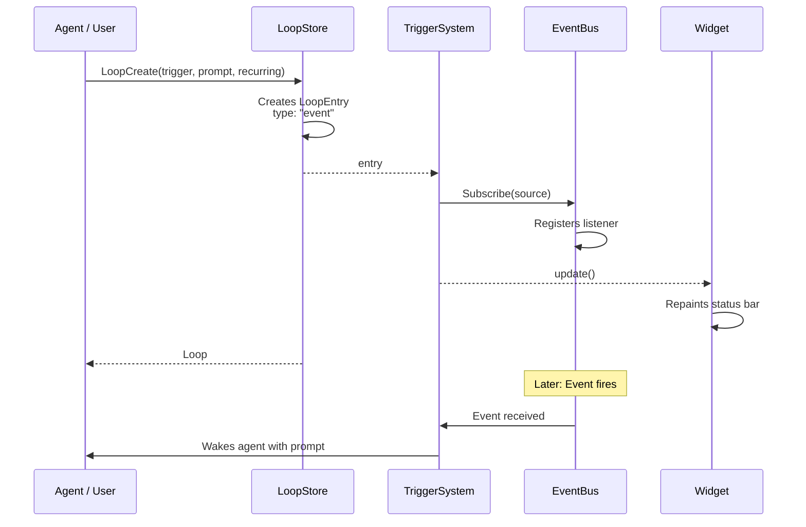
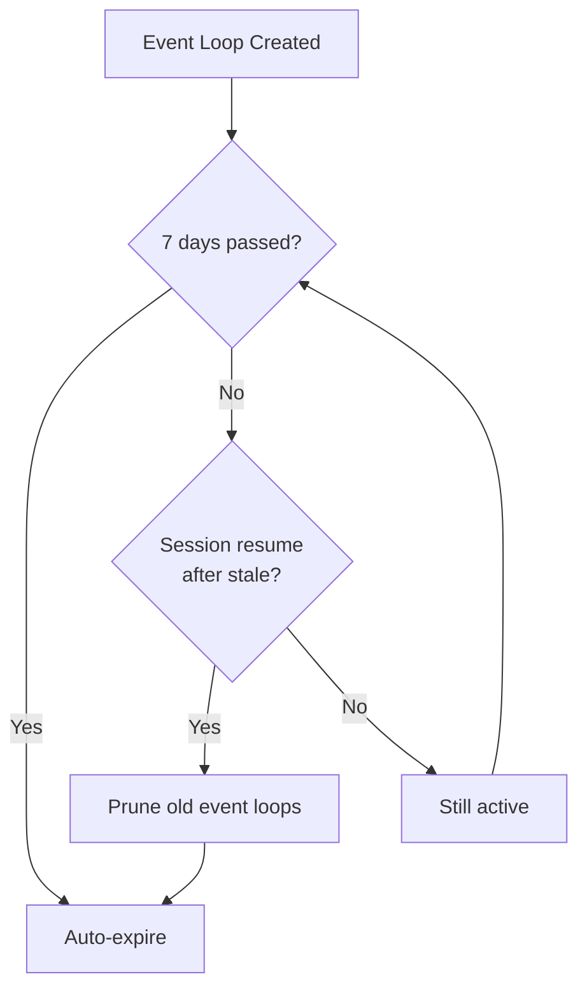

# Loop Create — Event Trigger

## When to Use

User wants the agent to react when a specific pi event fires (e.g., "when a tool execution ends", "when a task is created").

## Workflow Diagram



## Entry Points

### Via Tool: `LoopCreate`

1. Agent calls `LoopCreate` with:
   - `trigger`: event source name (e.g., `"tool_execution_end"`, `"tasks:created"`)
   - `prompt`: what to do when the event fires
   - `triggerType`: `"event"` (or inferred from non-cron string)
   - `recurring`: `true` (default for event triggers)

2. LoopStore creates a `LoopEntry` with:
   - `{ type: "event", source: "tool_execution_end" }`
   - 7-day expiry
   - Status: `active`

3. TriggerSystem registers the loop with event subscription

4. EventBus listener added for the specified source

### Via Command: `/loop` (interactive)

1. User types `/loop` with no args

2. Selects "Create event-triggered loop"

3. Prompts for:
   - Prompt (what to do)
   - Event source (e.g., `tool_execution_start`, `before_agent_start`)

4. Creates loop via `store.create()` + `triggerSystem.add()`

### Via Command: `/loop [prompt]` (ambiguous)

1. User types `/loop check task status`

2. Command detects no interval prefix

3. Shows selection:
   - `Scheduled: "check task status"`
   - `Event-triggered: "check task status"`

4. If "Event-triggered" selected → prompts for event source

## Available Event Sources

| Event | Trigger | Use Case |
|-------|---------|----------|
| `tool_execution_start` | Tool called | React to tool usage |
| `tool_execution_end` | Tool completed | Post-tool actions |
| `tasks:created` | Task created | New task notifications |
| `tasks:completed` | Task completed | Completion handling |
| `monitor:done` | Monitor finished | Post-build actions |
| `monitor:error` | Monitor failed | Error handling |
| `before_agent_start` | Agent idle | Idle-time checks |
| `agent_end` | Agent turn ends | Cleanup/completion |

## Data Structure

```typescript
// src/types.ts
interface LoopEntry {
  id: string;
  prompt: string;
  trigger: EventTrigger;
  status: "active" | "paused";
  recurring: boolean;
  createdAt: number;
  updatedAt: number;
  expiresAt: number;
  autoTask?: boolean;
  taskBacklog?: boolean;
  readOnly?: boolean;
  maxFires?: number;
  fireCount?: number;
}

interface EventTrigger {
  type: "event";
  source: string;           // e.g., "tasks:created"
  filter?: string;          // Optional regex or JSON filter
}
```

## Event Filtering

Events can include a `filter` parameter for precise matching:

```typescript
// Regex filter
{ type: "event", source: "tool_execution_end", filter: "LoopCreate|TaskCreate" }

// JSON filter (for structured events)
{ 
  type: "event", 
  source: "monitor:done", 
  filter: '{"monitorId":"abc123"}' 
}
```

## Expiry Behavior

Event loops expire when:



## Monitor Done Special Handling

When `source: "monitor:done"`:
1. System parses `filter` for `monitorId`
2. Checks if monitor is already completed
3. If completed → immediately removes loop
4. If still running → waits for completion event

## Relevant Files

| File | Purpose |
|------|---------|
| `src/types.ts` | LoopEntry, EventTrigger data structures |
| `src/store.ts` | LoopStore.create() persistence |
| `src/trigger-system.ts` | Event subscription management |
| `src/tools/loop-tools.ts` | LoopCreate tool implementation |
| `src/commands/loop-command.ts` | /loop command handler |

## Related Flows

- [Loop Create — Cron Trigger](./loop-create-cron.md)
- [Loop Create — Hybrid Trigger](./loop-create-hybrid.md)
- [Loop Delete/Pause](./loop-delete-pause.md)
