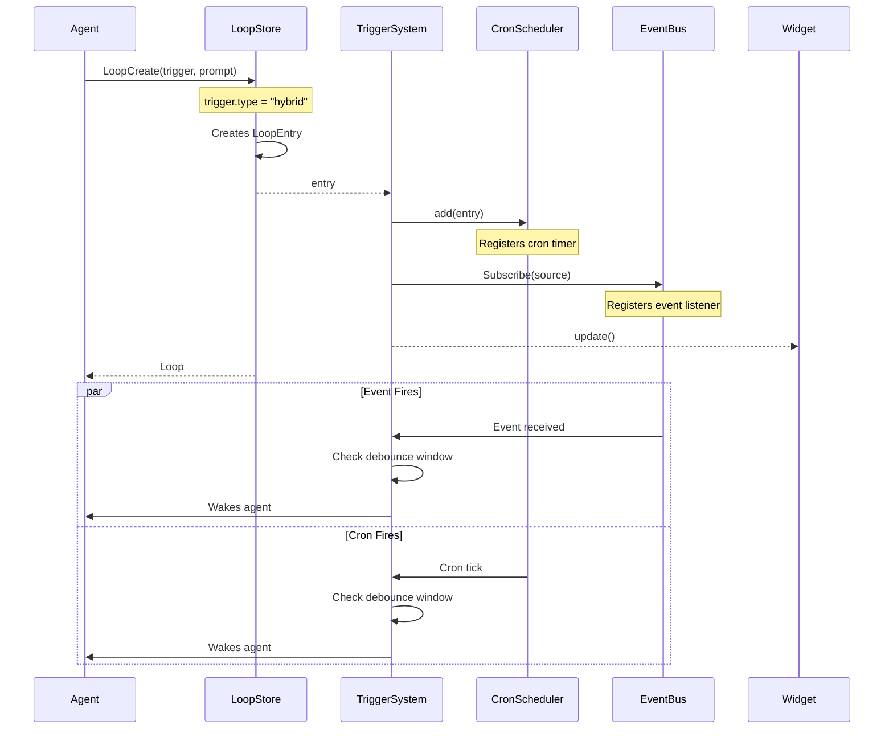
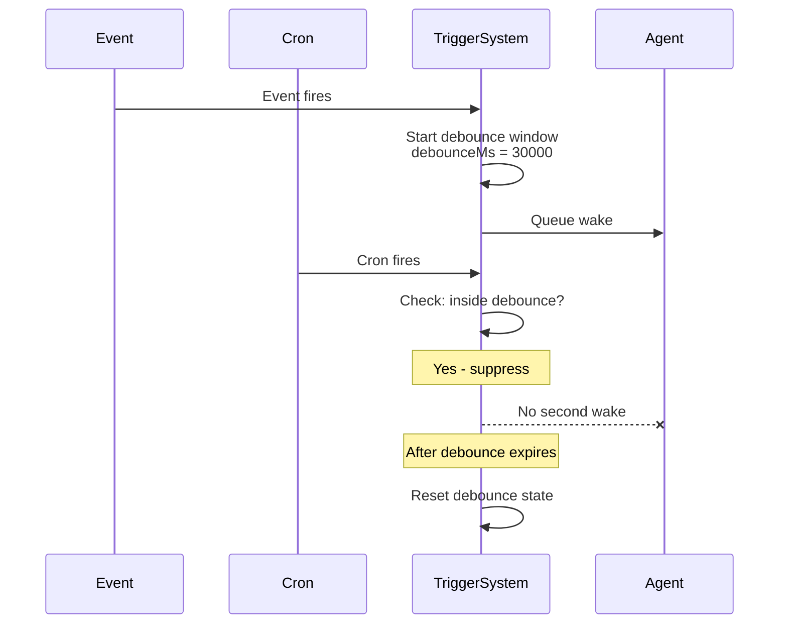

# Loop Create — Hybrid Trigger

## When to Use

User wants both:
1. **Event-driven responsiveness**: React immediately when something happens
2. **Cron safety-net**: Fall back to periodic checks if no events fire

Example: Watch for `monitor:done` events but also check every 10 minutes as a fallback.

## Workflow Diagram



## Debounce Behavior



## Entry Point

### Via Tool: `LoopCreate`

1. Agent calls `LoopCreate` with:
   - `trigger`: hybrid spec (cron + event)
   - `prompt`: what to do
   - `debounceMs`: debounce window (default: 30000ms)

2. LoopStore creates `LoopEntry` with:
   ```typescript
   {
     type: "hybrid",
     cron: "*/10 * * * *",    // Every 10 minutes
     event: { source: "monitor:done" },
     debounceMs: 30000
   }
   ```

3. TriggerSystem registers BOTH:
   - Cron timer with CronScheduler
   - Event subscription with EventBus

## Data Structure

```typescript
// src/types.ts
interface LoopEntry {
  id: string;
  prompt: string;
  trigger: HybridTrigger;
  status: "active" | "paused";
  recurring: boolean;
  createdAt: number;
  updatedAt: number;
  expiresAt: number;
  autoTask?: boolean;
  taskBacklog?: boolean;
  readOnly?: boolean;
  maxFires?: number;
  fireCount?: number;
}

interface HybridTrigger {
  type: "hybrid";
  cron: string;              // Cron expression
  event: {
    source: string;          // Event source name
    filter?: string;          // Optional filter
  };
  debounceMs: number;        // Debounce window in ms
}
```

## Trigger Input Format

Hybrid triggers can be specified as:
```typescript
// Full trigger parameter (JSON)
{
  trigger: {
    type: "hybrid",
    cron: "*/5 * * * *",
    event: { source: "monitor:done" },
    debounceMs: 60000
  },
  prompt: "Check CI status"
}

// Or parsed from string (inferred)
{
  trigger: "cron:*/5 * * * * event:monitor:done",
  triggerType: "hybrid",
  debounceMs: 60000,
  prompt: "Check CI status"
}
```

## Monitor Done Special Handling

When `source: "monitor:done"`:
1. System checks if monitor is already completed
2. If completed → loop immediately removed
3. If running → waits for monitor:done event

## Relevant Files

| File | Purpose |
|------|---------|
| `src/types.ts` | LoopEntry, HybridTrigger data structures |
| `src/store.ts` | LoopStore.create() persistence |
| `src/trigger-system.ts` | Dual registration (cron + event) |
| `src/scheduler.ts` | CronScheduler for timer management |
| `src/tools/loop-tools.ts` | LoopCreate tool implementation |

## Related Flows

- [Loop Create — Cron Trigger](./loop-create-cron.md)
- [Loop Create — Event Trigger](./loop-create-event.md)
- [Monitor Create](./monitor-create.md)
