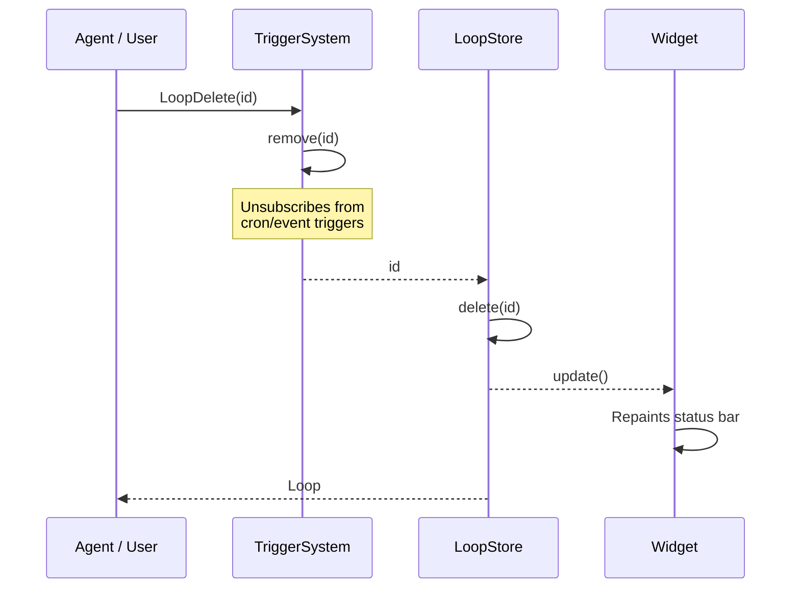
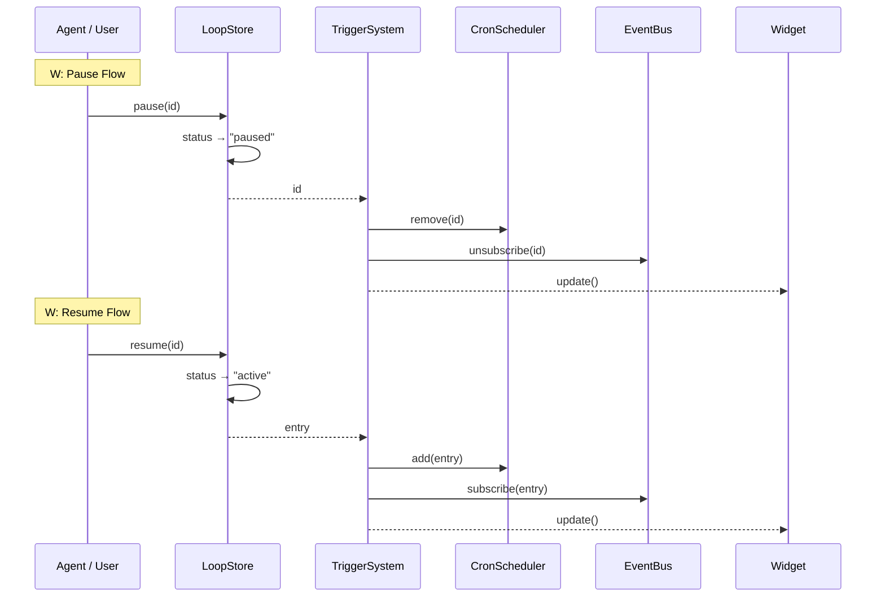
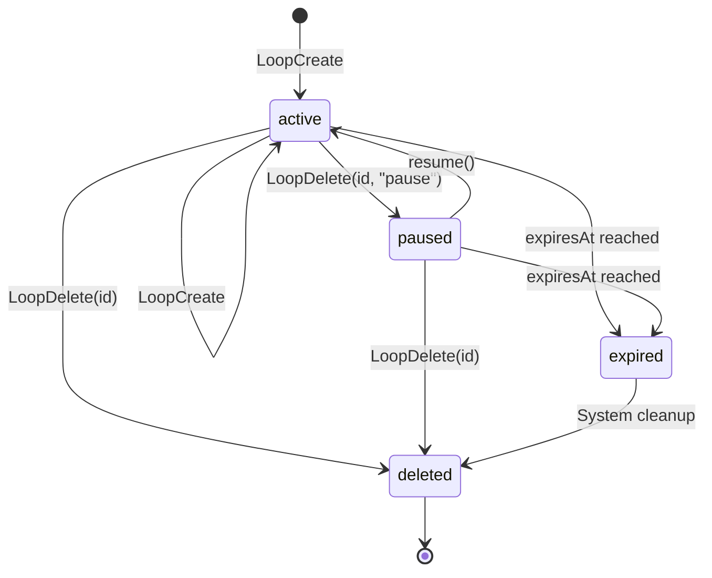

# Loop Delete / Pause

## When to Use

- User wants to permanently stop a loop (`delete`)
- User wants to temporarily stop a loop without removing it (`pause`)
- User wants to resume a paused loop

## Delete Workflow



## Pause/Resume Workflow



## State Transitions



## Entry Points

### Delete via Tool: `LoopDelete`

1. Agent calls `LoopDelete({ id: "123" })`

2. System:
   - Removes trigger from TriggerSystem (no more fires)
   - Deletes entry from LoopStore
   - Updates widget

3. Returns confirmation or "not found" if ID invalid

### Delete via Command: `/loop` → "View loops"

1. User runs `/loop`

2. Selects "View loops"

3. Selects a loop from the list

4. Chooses "x Delete"

5. System removes trigger + deletes entry

### Pause via Tool: `LoopDelete` with action

1. Agent calls `LoopDelete({ id: "123", action: "pause" })`

2. System:
   - Updates loop status to `paused`
   - Removes trigger from TriggerSystem (stops firing)
   - Keeps entry in LoopStore (can be resumed)

3. Returns confirmation

### Resume via Command: `/loop` → "View loops"

1. User selects a paused loop (`-`)

2. Chooses "* Resume"

3. System:
   - Updates status to `active`
   - Re-adds trigger to TriggerSystem
   - Loop starts firing again

4. **Note:** This path does NOT update the bindings file. The loop resumes in-process but will not be re-armed automatically on session restart. Use `/loop-resume <id>` for bindings-aware resume.

### Resume via `/loop-resume <id>` — Recommended

`/loop-resume <id>` is the **recommended way** to resume a loop. It does three things atomically:

1. `store.resume(id)` — sets status to `active` (idempotent)
2. `triggerSystem.add(entry)` — re-subscribes cron timer / event listener
3. `bindings.add(id)` — records this session's intent to arm this loop in `bindings-<sessionId>.json`

On session restart, `showPersistedLoops()` reads the bindings file and re-arms exactly those loops automatically. See [Loop Resume](./loop-resume.md).

### Resume via Tool: `LoopDelete({ action: "resume" })`

Agent calls `LoopDelete({ id: "123", action: "resume" })`:

1. `store.resume(id)` — sets status to `active` (idempotent)
2. `triggerSystem.add(entry)` — re-subscribes the trigger
3. Loop starts firing again

**Bindings note:** This tool does NOT update the bindings file. For bindings-aware resume, use `/loop-resume <id>`.

## Data Structure

```typescript
// src/types.ts
interface LoopEntry {
  id: string;
  prompt: string;
  trigger: Trigger;
  status: "active" | "paused";  // Key field for pause/resume
  recurring: boolean;
  createdAt: number;
  updatedAt: number;
  expiresAt: number;
  // ... other fields
}

type LoopStatus = "active" | "paused";
```

## Edge Cases

| Scenario | Behavior |
|----------|----------|
| Delete non-existent ID | Returns "not found" (no error) |
| Pause already paused | No-op, returns success |
| Resume already active | No-op, returns success |
| Pause while firing | Completes current fire, then pauses |
| Delete while firing | Current fire completes, then deleted |

## Auto-Deletion Triggers

Loops are automatically removed when:

| Condition | Description |
|-----------|-------------|
| `maxFires` reached | `fireCount >= maxFires` |
| 7-day expiry | `Date.now() >= expiresAt` |
| Monitor completed | Event loop for `monitor:done` when monitor done |
| Session clear | `clearAll()` called on session shutdown |

## Relevant Files

| File | Purpose |
|------|---------|
| `src/store.ts` | LoopStore.pause(), resume(), delete() |
| `src/trigger-system.ts` | TriggerSystem.remove() |
| `src/scheduler.ts` | CronScheduler cleanup |
| `src/tools/loop-tools.ts` | LoopDelete tool |
| `src/commands/loop-command.ts` | /loop interactive menu |

## Related Flows

- [Loop Create — Cron Trigger](./loop-create-cron.md)
- [Loop List](./loop-list.md)
