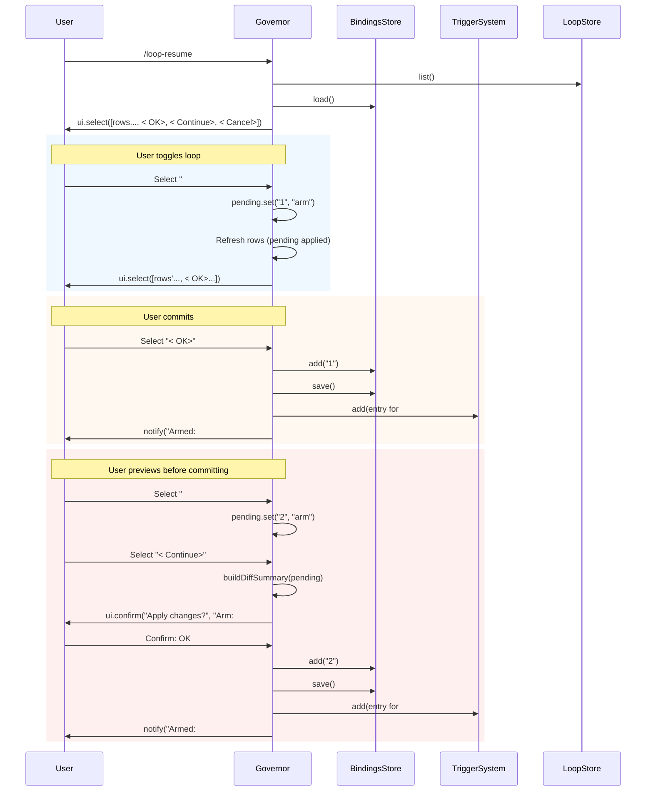
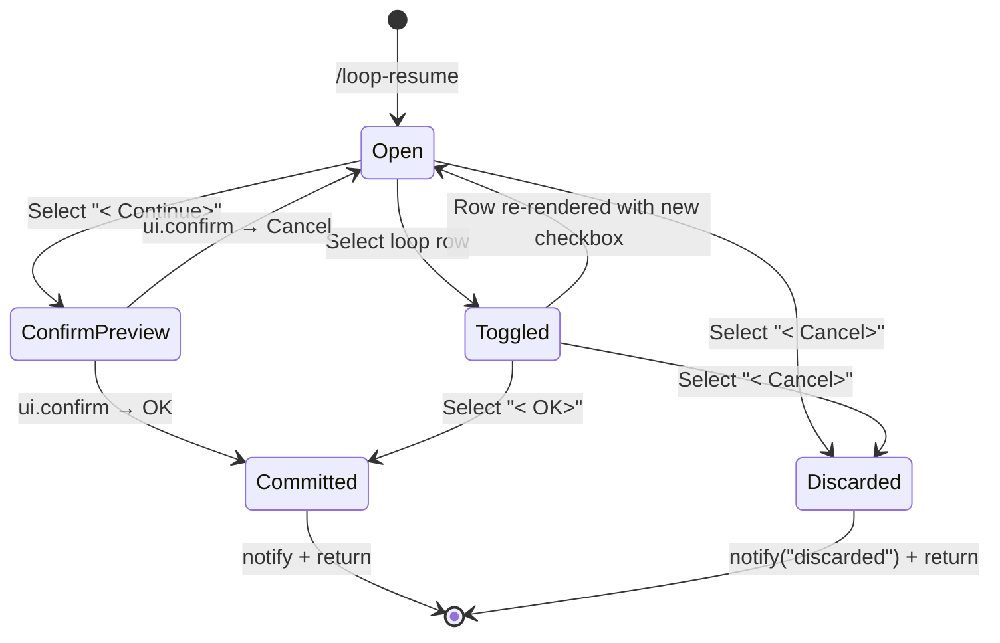

# Loop Governor

## When to Use

User wants to manage **which loops this terminal arms** — arm new loops, disarm existing ones, or review their current bindings — without touching the project loop registry (stored loops). The Governor is the UI for per-session bindings.

The Governor is opened by running `/loop-resume` with no arguments.

## Two Modes

| Mode | Command | Effect |
|------|---------|--------|
| **Governor picker** | `/loop-resume` (no args) | Interactive picker to arm/disarm loops for this session |
| **One-shot** | `/loop-resume <id>` | Arm and bind a single loop in one call |

See [Loop Resume](./loop-resume.md) for the one-shot path.

## Governor Picker UX

### Entry

```
User types /loop-resume
  → openGovernor(ui, bindingsStore)
  → getStore().list() — all stored loops
  → getBindingsStore().load() — this session's bindings
  → ui.select("Governor — toggle loops...", [...rows, < OK>, < Continue>, < Cancel>])
```

### Row Format

Each loop is displayed as:
```
[x] #1 [active] Check the deploy (cron: */5 * * * *)
```

Where:
- `[x]` = loop is **bound** to this session (will arm on OK)
- `[ ]` = loop is **not bound** (stays disarmed on OK)
- `[status]` = loop's registry status: `active`, `paused`, or `expired`
- The checkbox reflects THIS session's binding state — not just whether the trigger is currently armed in-process

For hybrid loops, the full event source and debounce are shown:
```
hybrid: */5 * * * * + event:tool_execution_start (30000ms debounce)
```

### Sentinel Rows

Three sentinels at the bottom of the picker:

| Sentinel | Behavior |
|----------|----------|
| `< OK>` | Commit all pending toggles, write bindings file, apply `triggerSystem.add/remove`, exit |
| `< Continue>` | Open `ui.confirm` with diff preview; OK applies, Cancel returns to picker |
| `< Cancel>` | Discard pending toggles, exit without writing |

### Interaction Flow



## Governor State Machine



## The Pending Map

While in the picker, user toggles are accumulated in an in-memory `pending: Map<string, "arm" | "disarm">`. The final bound state for a loop is computed as:

```
finalBound(id) = bindings.has(id) XOR pending.get(id)
```

| bindings.has(id) | pending.get(id) | Final Bound |
|-------------------|-----------------|-------------|
| `false` | `undefined` | `false` (unchanged unbound) |
| `false` | `"arm"` | `true` (arm this session) |
| `true` | `undefined` | `true` (unchanged bound) |
| `true` | `"disarm"` | `false` (disarm this session) |
| `false` | `"disarm"` | `false` (no-op, already unbound) |
| `true` | `"arm"` | `true` (no-op, already bound) |

## Diff Preview on `< Continue >`

When the user selects `< Continue>`, the Governor computes a diff summary:

```
Apply changes?
Arm: #2, #5
Disarm: #7
```

Clicking OK in the confirm applies all pending changes. Clicking Cancel returns to the picker without applying.

**Note:** The diff shows only pending toggles from this session — not the full committed state. If a loop was already bound before opening the Governor, it does not appear in the diff unless the user toggled it.

## Strict Isolation Default

On first open (no bindings file yet), the Governor shows all `[ ]` checkboxes — no loops are pre-checked. The user must explicitly arm each loop they want this terminal to run.

## What the Governor Does NOT Do

| Action | In Governor? | How to Do It |
|--------|-------------|--------------|
| Create a new loop | ❌ | Use `/loop` |
| Delete a loop | ❌ | Use `/loop` → "View loops" → Delete |
| Pause a loop | ❌ | Use `/loop` → "View loops" → Pause |
| Resume a loop | ❌ | Use `/loop-resume <id>` |
| Change loop prompt/trigger | ❌ | Delete and recreate |
| View only (no toggle) | ❌ | Planned: see Enhancement #22 |

## Relevant Files

| File | Purpose |
|------|---------|
| `src/commands/loop-command.ts` | `openGovernor`, `applyPending`, `buildGovernorRows`, `buildDiffSummary` |
| `src/runtime/bindings-store.ts` | BindingsStore read/write |
| `src/trigger-system.ts` | `triggerSystem.add/remove` for arm/disarm |
| `src/store.ts` | LoopStore.list(), LoopStore.get() for loop metadata |

## Related Flows

- [Per-Session Bindings](./per-session-bindings.md) — the underlying isolation mechanism
- [Loop Resume](./loop-resume.md) — the one-shot `/loop-resume <id>` path
- [Session Lifecycle](./session-lifecycle.md) — how bindings load on session start
