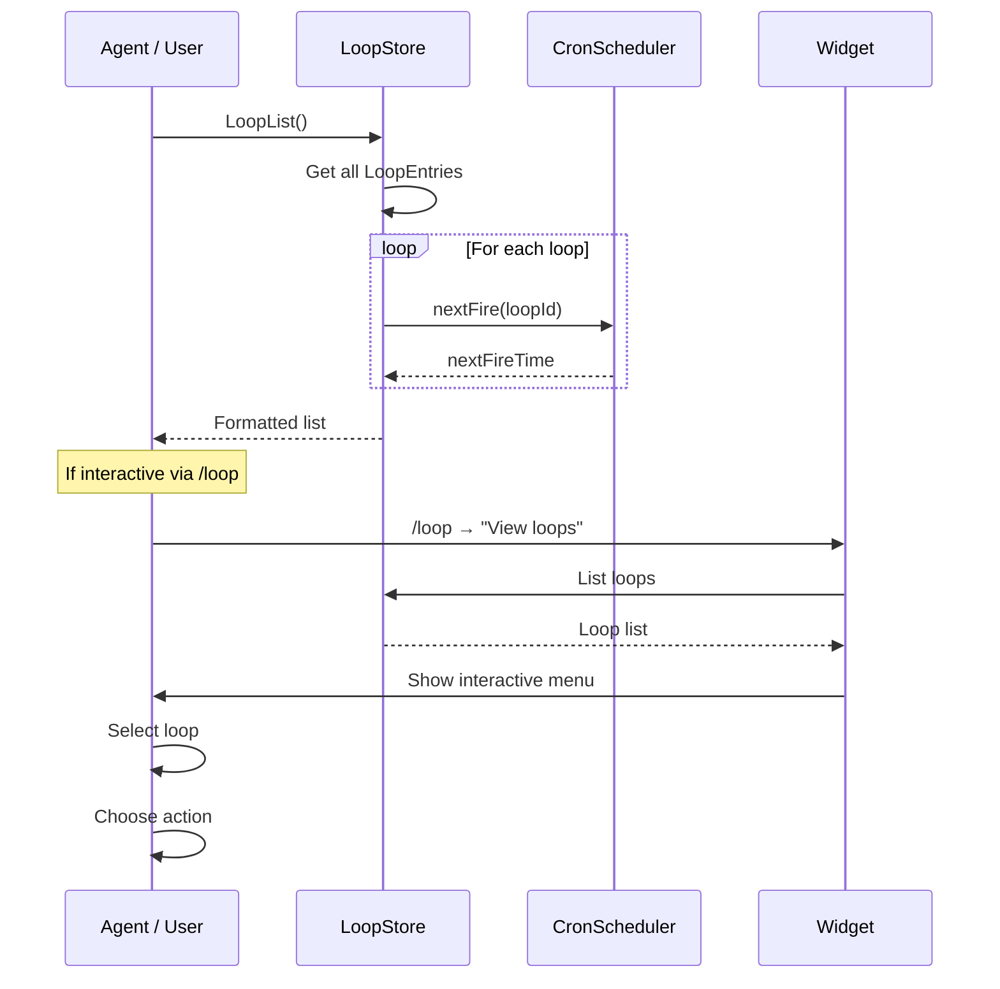
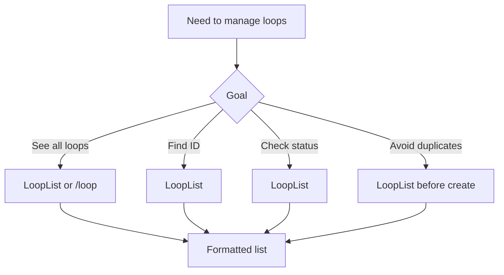

# Loop List

## When to Use

- User wants to see all active loops and their status
- Agent needs to find a loop ID for deletion/pause
- Checking if a loop already exists before creating a duplicate

## Workflow Diagram



## Entry Points

### Via Tool: `LoopList`

1. Agent or user calls `LoopList` (no parameters)

2. System retrieves all loops from LoopStore

3. Returns formatted list showing:
   - Status icon (`*` active, `-` paused, `x` expired)
   - Loop ID (`#123`)
   - Status badge
   - Prompt (truncated to 60 chars)
   - Trigger description
   - Next fire time (for cron/hybrid loops)
   - Special flags: `[auto-task]`, `[backlog-worker]`

### Via Command: `/loop` → "View loops"

1. User runs `/loop`

2. Selects "View loops"

3. Interactive menu shows all loops with same format

4. User can select a loop to:
   - Delete
   - Pause (if active)
   - Resume (if paused)

## Output Format

```
* #1 [active] Check deploy status (cron: */5 * * * *) next: 3m
- #2 [paused] Monitor CI pipeline (event: monitor:done)
* #3 [active] Process task backlog (hybrid: 0 * * * * + tasks:created) [backlog-worker]
* #4 [active] Watch builds (cron: */10 * * * *) [auto-task] next: 8m
```

## Data Structure

```typescript
// src/types.ts
interface LoopEntry {
  id: string;
  prompt: string;
  trigger: CronTrigger | EventTrigger | HybridTrigger;
  status: "active" | "paused";
  recurring: boolean;
  createdAt: number;
  updatedAt: number;
  expiresAt: number;
  autoTask?: boolean;
  taskBacklog?: boolean;
  readOnly?: boolean;
  maxFires?: number;
  fireCount?: number;
}

interface LoopStoreData {
  nextId: number;
  loops: LoopEntry[];
}
```

## Loop Status Icons

| Icon | Status | Meaning |
|------|--------|---------|
| `*` | active | Loop is scheduled and will fire |
| `-` | paused | Loop is paused, can be resumed |
| `x` | expired | Loop past expiry, pending cleanup |

## Special Flags

| Flag | Meaning |
|------|---------|
| `[auto-task]` | Loop auto-creates tasks via pi-tasks |
| `[backlog-worker]` | Task backlog worker loop |
| `next: Xm` | Minutes until next fire |
| `next: Xs` | Seconds until next fire |
| `next: Xh` | Hours until next fire |

## Use Cases



## Relevant Files

| File | Purpose |
|------|---------|
| `src/store.ts` | LoopStore.list() retrieval |
| `src/scheduler.ts` | CronScheduler.nextFire() for timing |
| `src/tools/loop-tools.ts` | LoopList tool implementation |
| `src/commands/loop-command.ts` | /loop "View loops" subcommand |
| `src/ui/widget.ts` | Status bar widget |

## Related Flows

- [Loop Create — Cron Trigger](./loop-create-cron.md)
- [Loop Delete/Pause](./loop-delete-pause.md)
