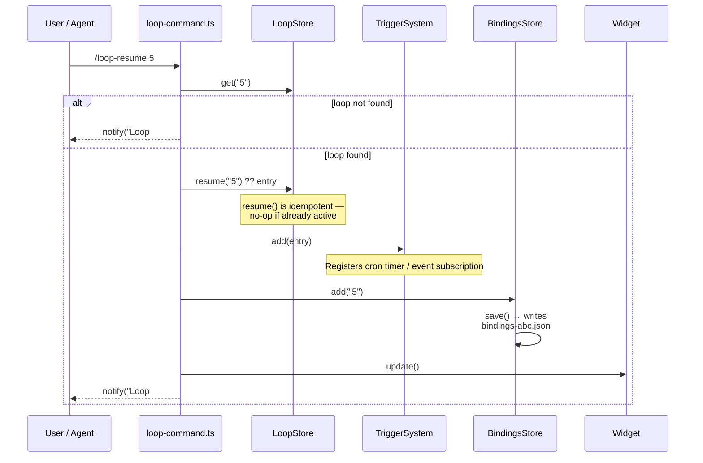

# Loop Resume

## When to Use

**One-shot**: Re-arm a stored loop and bind it to the current session in a single call. Use this after a session/process restart when a loop's trigger subscription was lost and you want to restore it.

**Governor**: Open the interactive picker to manage which loops this session arms. See [Loop Governor](./loop-governor.md).

## Entry Points

| Command | Mode |
|---------|------|
| `/loop-resume 5` | **One-shot**: arm loop #5 and bind it |
| `/loop-resume` | **Governor**: interactive picker |

## One-Shot Path

### Workflow Diagram



### Sequence

```
/loop-resume <id>
  1. Parse <id> — must be numeric, reject non-numeric with error
  2. store.get(<id>) — must exist in the project registry
  3. store.resume(<id>) — idempotent, sets status to active
  4. triggerSystem.add(entry) — rebinds cron timer / event subscription
  5. bindings.add(<id>) — writes to bindings-<sessionId>.json
  6. updateWidget() — refresh status bar
  7. notify("Loop #N re-armed and bound to this session", "info")
  8. return (single call, no picker)
```

### Idempotency

`store.resume(id)` is idempotent — calling it on an already-active loop is a no-op. `bindings.add(id)` is also idempotent. This means running `/loop-resume 5` multiple times is safe.

### When to Use One-Shot vs Governor

| Situation | Command |
|-----------|---------|
| Restore one known loop after a restart | `/loop-resume <id>` |
| Set up bindings for a new session | Governor (`/loop-resume`) |
| Arm multiple loops at once | Governor — toggle each, then OK |
| Check current bindings | Governor — check `[x]` checkboxes |
| Bind a loop and arm a new terminal | `/loop-resume <id>` then close the Governor immediately |

## Governor Path

See [Loop Governor](./loop-governor.md) for the full picker UX.

## Bindings and Trigger System

The one-shot path does **three** things:

1. **Store**: `store.resume(id)` — updates loop status to `active` in the project registry (shared across all sessions)
2. **Trigger**: `triggerSystem.add(entry)` — re-subscribes the cron timer or event listener in this process
3. **Bindings**: `bindings.add(id)` — records this session's intent to arm this loop

The bindings file is the **source of truth** for which loops this terminal should fire. On session restart, `showPersistedLoops()` reads the bindings file and re-arms exactly those loops.

The `store.resume(id)` call updates the **shared registry** (`loops.json`), so other sessions see the loop as `active`. But those other sessions only fire the loop if their own bindings files also contain that loop's ID.

## Relationship to `LoopDelete action='resume'`

`/loop-resume <id>` is the **command equivalent** of calling `LoopDelete({ id, action: "resume" })` with the additional step of writing the bindings file.

```
LoopDelete({ id: "5", action: "resume" })
  → store.resume("5")          ✓ same
  → triggerSystem.add(entry)   ✓ same
  → (no bindings.write)        ✗ missing

/loop-resume 5
  → store.resume("5")          ✓ same
  → triggerSystem.add(entry)    ✓ same
  → bindings.add("5")           ✓ NEW — bindings-aware
  → updateWidget()              ✓ same
  → notify(...)                 ✓ same
```

## Error Handling

| Error | Response |
|-------|----------|
| `id` is non-numeric | `notify("Expected a numeric loop ID, got 'abc'. Try /loop-resume <id> or /loop-resume (no args) for the governor.", "error")` |
| Loop not found in store | `notify("Loop #99 not found in the store. Use /loop to create one first.", "error")` |
| UI context lacks `notify` | Defensive — silently skip notify call |
| SessionId unknown (extension startup) | `rearmLoopOneShot` uses the current BindingsStore path — if undefined, `bindings.add()` is a no-op in memory scope |

## Session Restart Behavior

```
Session A starts fresh
  → no bindings-abc.json
  → notify("No bindings...")
  → zero loops armed

User: /loop-resume 5
  → bindings-abc.json created: {loopIds: ["5"]}
  → triggerSystem.add(#5) registered
  → Loop #5 fires when schedule matches

Session A restarts (new process)
  → bindings-abc.json exists: {loopIds: ["5"]}
  → load() → Set{"5"}
  → triggerSystem.add(#5) registered automatically
  → Loop #5 continues firing — no manual intervention needed
```

## Relevant Files

| File | Purpose |
|------|---------|
| `src/commands/loop-command.ts` | `rearmLoopOneShot` function, `/loop-resume` command registration |
| `src/runtime/bindings-store.ts` | `bindings.add()`, `bindings.save()` |
| `src/store.ts` | `store.resume()` idempotent re-arm |
| `src/trigger-system.ts` | `triggerSystem.add()` re-subscription |
| `src/runtime/session-runtime.ts` | `showPersistedLoops()` auto-restores bindings on start |

## Related Flows

- [Loop Governor](./loop-governor.md) — interactive picker for managing bindings
- [Per-Session Bindings](./per-session-bindings.md) — isolation mechanism
- [Loop Delete/Pause](./loop-delete-pause.md) — `LoopDelete action='resume'` equivalence
