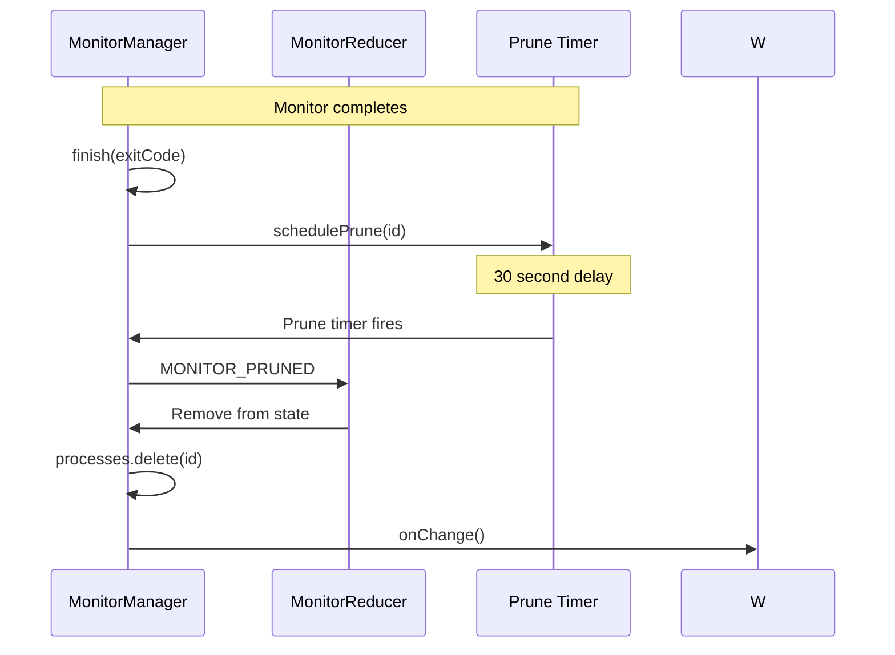
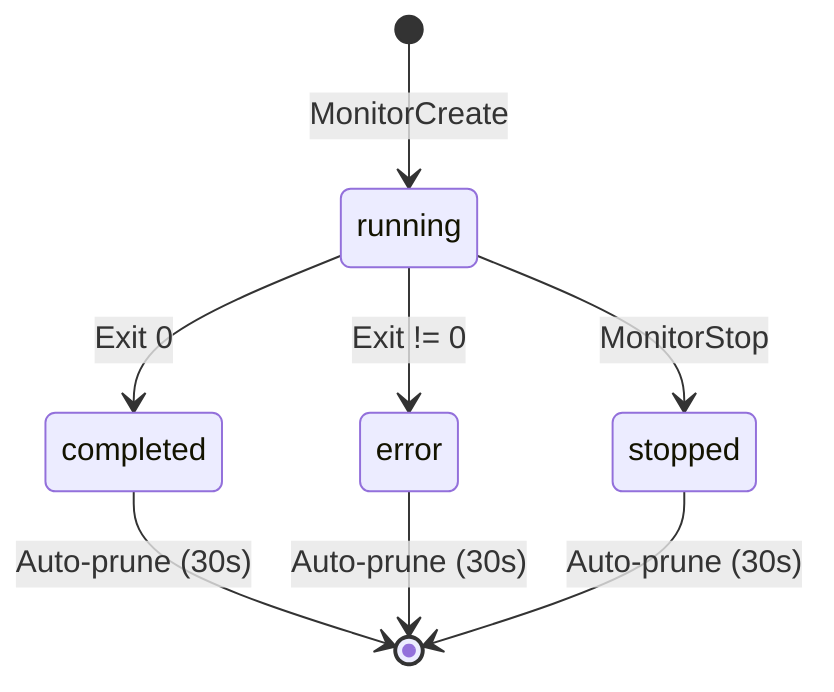

# Monitor Auto-Prune

## When to Use

Internal workflow — automatically triggered 30 seconds after a monitor reaches a terminal state (`completed`, `error`, or `stopped`). Removes the monitor from the list to prevent accumulation.

## Workflow Diagram



## Implementation

```typescript
// src/monitor-manager.ts
private schedulePrune(id: string): void {
  // Unref so it never keeps a one-shot process alive
  const timer = setTimeout(() => {
    this.applyReducerEvent({
      type: "MONITOR_PRUNED",
      at: Date.now(),
      source: "system",
      entityType: "monitor",
      entityId: id,
      payload: { id },
    });
  }, 30000);
  timer.unref?.();
}
```

## Trigger Points

| Event | Timer Started |
|-------|-------------|
| `child.on("close", ...)` | ✅ |
| `child.on("error", ...)` | ✅ |
| `MonitorStop()` | ✅ |

Every terminal state transition schedules a prune timer.

## Timer Behavior

| Property | Value |
|----------|-------|
| Delay | 30 seconds |
| Node.js `unref()` | Yes (never blocks process exit) |
| Idempotent | Yes (timer fires, monitor already gone = no-op) |

## Why 30 Seconds?

Allows tool consumers (including the agent) to retrieve the final state via `MonitorList` within a reasonable window before the monitor disappears from the list.

```
0s          10s         20s         30s
 |           |           |           |
 v           v           v           v
Monitor     Monitor     Monitor     Monitor
starts      running     completes   PRUNED
                                    (gone from list)
         <-- 30s window for MonitorList -->
```

## State Transitions



## Monitor Lifetime

```
┌─────────────────────────────────────────────┐
│ Monitor Lifecycle                            │
├─────────────────────────────────────────────┤
│                                             │
│  MonitorCreate()                            │
│       │                                     │
│       ├── spawn child process               │
│       │                                     │
│       └── status: "running"                 │
│                    │                        │
│         ┌──────────┼──────────┐             │
│         ▼          ▼          ▼             │
│    completed    error      stopped           │
│         │          │          │             │
│         └──────────┴──────────┘             │
│                    │                        │
│              schedulePrune(30s)             │
│                    │                        │
│                    ▼                        │
│              MONITOR_PRUNED                 │
│                    │                        │
│              (removed from list)             │
│                                             │
└─────────────────────────────────────────────┘
```

## Relevant Files

| File | Purpose |
|------|---------|
| `src/monitor-manager.ts` | schedulePrune(), finish(), stop() |
| `src/monitor-reducer.ts` | MONITOR_PRUNED event handling |

## Related Flows

- [Monitor Create](./monitor-create.md)
- [Monitor Stop](./monitor-stop.md)
- [Monitor List](./monitor-list.md)
