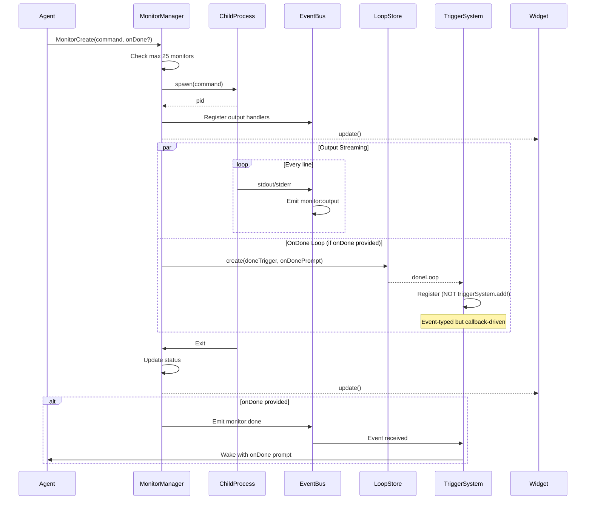
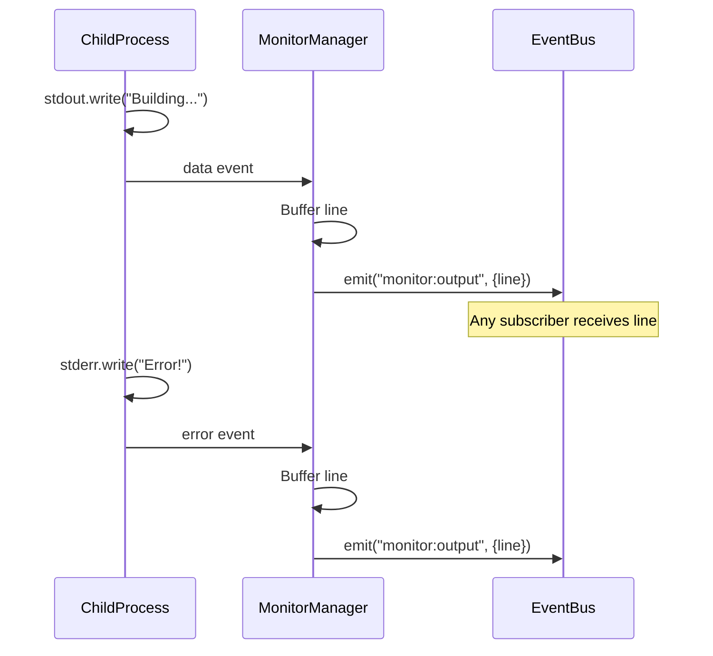
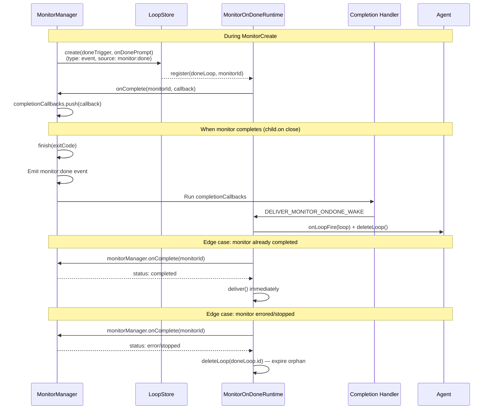
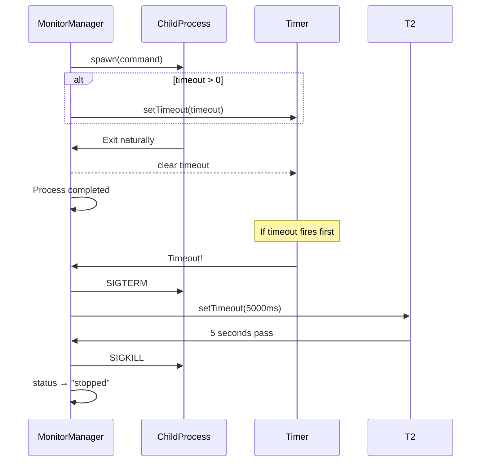

# Monitor Create

## When to Use

- User wants to run a long-running command in background
- User wants to parallelize work (run multiple commands simultaneously)
- User wants to watch a build/CI job without blocking
- User wants to run an experiment and be notified on completion

## Workflow Diagram



## Output Streaming



## Entry Point

### Via Tool: `MonitorCreate`

1. Agent calls `MonitorCreate` with:
   - `command`: shell command to run
   - `description`: optional human-readable label
   - `timeout`: max runtime in ms (default: 300000 = 5min)
   - `onDone`: optional prompt for completion handling

2. System:
   - Checks running monitor count (max 25)
   - Spawns child process
   - Registers with MonitorManager
   - Streams output via `monitor:output` events
   - Updates widget

3. Returns monitor ID for tracking/stopping

## With onDone Callback

When `onDone` is provided, the system creates a one-shot loop linked to the monitor via an internal callback — NOT a TriggerSystem event subscription.



**Critical distinction**: The onDone loop is a LoopStore entry (persisted, visible in LoopList) but is NOT registered with TriggerSystem. Its delivery is driven by `MonitorManager.onComplete()` callbacks registered in `MonitorOnDoneRuntime`.

## Completion Events

| Exit Type | Event Emitted | Status |
|-----------|---------------|--------|
| Clean exit (code 0) | `monitor:done` | `completed` |
| Non-zero exit | `monitor:done` | `completed` |
| Uncaught error | `monitor:error` | `error` |
| SIGTERM timeout | `monitor:done` | `stopped` |

## Data Structure

```typescript
// src/types.ts
interface MonitorEntry {
  id: string;
  command: string;
  description?: string;
  timeout: number;
  status: "running" | "completed" | "error" | "stopped";
  startedAt: number;
  completedAt?: number;
  exitCode?: number;
  outputLines: number;
  outputBuffer: string[];
}

interface MonitorProcess {
  entry: MonitorEntry;
  pid: number;
  proc: ChildProcess;
  abortController: AbortController;
  waiters: Array<() => void>;
  completionCallbacks: Array<() => void>;
}
```

## Timeout Handling

| Setting | Value | Behavior |
|---------|-------|----------|
| Default | 300000ms (5 min) | Auto-terminate after 5 minutes |
| Custom | User-specified | Terminate after N ms |
| None | 0 | Run indefinitely |



## Widget Display

Widget shows running monitors count:
```
Loops: 3 | Monitors: 2 >
```

## Relevant Files

| File | Purpose |
|------|---------|
| `src/types.ts` | MonitorEntry, MonitorProcess structures |
| `src/monitor-manager.ts` | Process spawning, output buffering |
| `src/runtime/monitor-ondone-runtime.ts` | onDone callback handling |
| `src/tools/monitor-tools.ts` | MonitorCreate tool |
| `src/ui/widget.ts` | Status bar widget |

## Related Flows

- [Monitor List](./monitor-list.md)
- [Monitor Stop](./monitor-stop.md)
- [Loop Create — Event Trigger](./loop-create-event.md)
