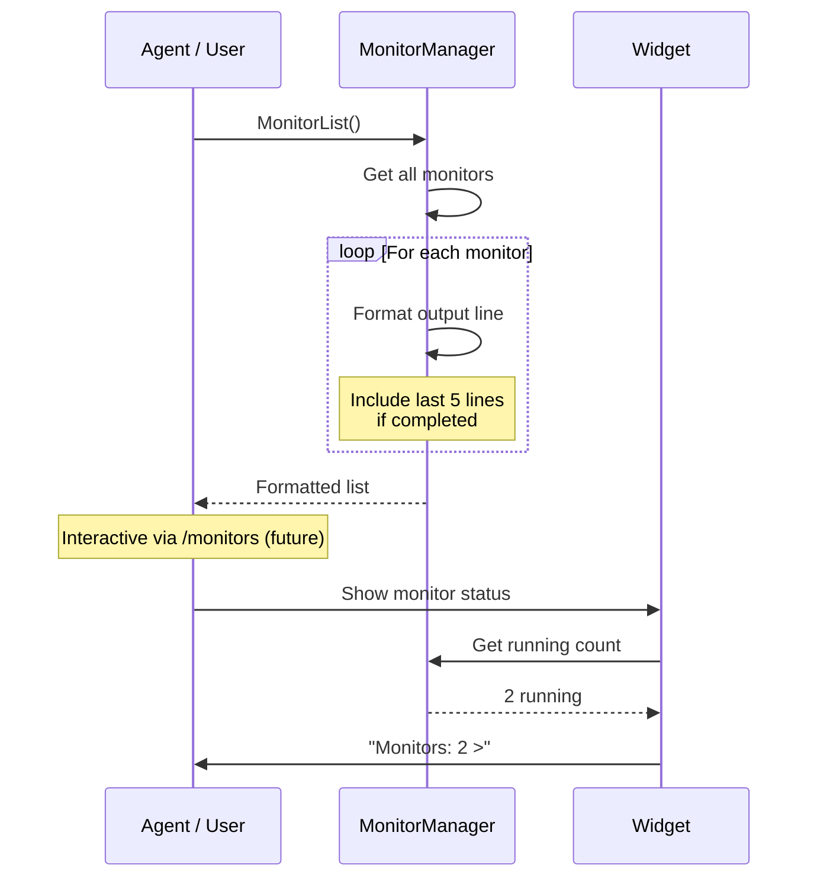

# Monitor List

## When to Use

- User wants to see status of all running/completed monitors
- Agent needs to find a monitor ID for stopping
- User wants to see recent output from a monitor
- Checking if a long-running command is still active

## Workflow Diagram



## Entry Point

### Via Tool: `MonitorList`

1. Agent or user calls `MonitorList` (no parameters)

2. System retrieves all monitors from MonitorManager

3. Returns formatted list showing:
   - Status icon (`>` running, `ok` completed, `x` error/stopped)
   - Monitor ID (`#123`)
   - Status badge
   - Command (truncated to 60 chars)
   - Output line count
   - Age (time since started)
   - Exit code (for completed monitors)

4. For completed monitors: shows last 5 buffered output lines

## Output Format

```
> #1 [running] npm run build — 47 lines (2m)
x #2 [error] python train.py — 128 lines (5m) exit=1
  |   File "train.py", line 42, in main
  |     raise ValueError("Invalid hyperparameter")
  |   ValueError: Invalid hyperparameter
ok #3 [completed] echo "done" — 1 lines (10s) exit=0
```

## Status Icons

| Icon | Status | Color | Meaning |
|------|--------|-------|---------|
| `>` | running | Active | Monitor is executing |
| `ok` | completed | Success | Clean exit (code 0) |
| `x` | error | Error | Non-zero exit or failure |
| `x` | stopped | Warning | SIGTERM/SIGKILL |

## Data Structure

```typescript
// src/types.ts
interface MonitorEntry {
  id: string;
  command: string;
  description?: string;
  timeout: number;
  status: "running" | "completed" | "error" | "stopped";
  startedAt: number;
  completedAt?: number;
  exitCode?: number;
  outputLines: number;
  outputBuffer: string[];  // Buffered for retrieval
}

interface MonitorProcess {
  entry: MonitorEntry;
  pid: number;
  proc: ChildProcess;
  abortController: AbortController;
  waiters: Array<() => void>;
  completionCallbacks: Array<() => void>;
}
```

## Information Available

| Field | Description | Available When |
|-------|-------------|---------------|
| ID | Monitor identifier | Always |
| Status | `running`, `completed`, `error`, `stopped` | Always |
| Command | Original shell command | Always |
| Output lines | Total lines captured | Always |
| Age | Time since start | Always |
| Exit code | Process exit code | `completed` or `error` |
| Output buffer | Last 5 lines | Non-running |

## Output Buffer Management

```mermaid
flowchart TD
    A[New output line] --> B{Buffer < 1000 lines?}
    B -->|Yes| C[Append to buffer]
    B -->|No| D[Shift oldest line]
    D --> C
    C --> E[Increment outputLines]

    Note over E: Last 5 lines always retained<br/>for MonitorList display
```

## Relevant Files

| File | Purpose |
|------|---------|
| `src/monitor-manager.ts` | MonitorManager.list() |
| `src/types.ts` | MonitorEntry structure |
| `src/tools/monitor-tools.ts` | MonitorList tool |
| `src/ui/widget.ts` | Status bar widget |

## Related Flows

- [Monitor Create](./monitor-create.md)
- [Monitor Stop](./monitor-stop.md)
