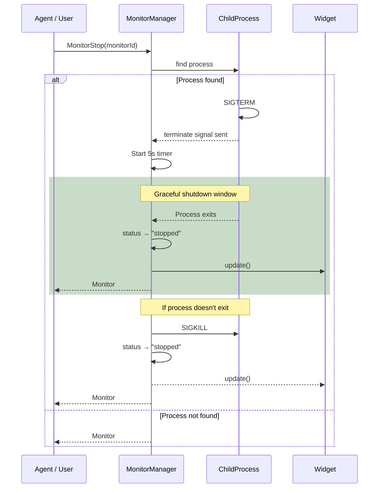
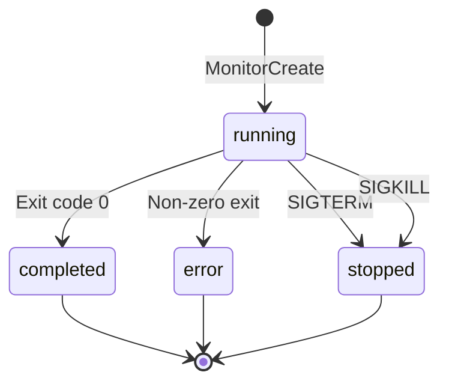
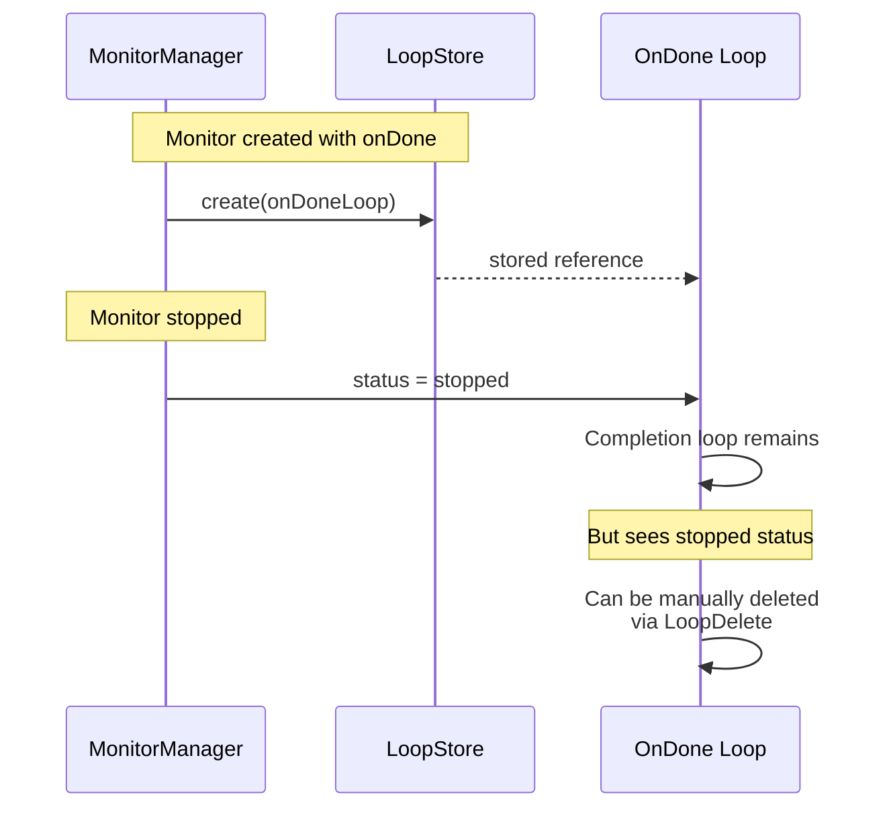

# Monitor Stop

## When to Use

- User wants to terminate a running monitor early
- User realizes the command is stuck or taking too long
- User changed their mind about the background task

## Workflow Diagram



## Graceful Shutdown Sequence

```mermaid
sequenceDiagram
    participant A as Agent
    participant M as MonitorManager
    participant P as ChildProcess

    A->>M: MonitorStop(#1)
    M->>P: SIGTERM
    Note over P: Process receives SIGTERM

    par Wait for graceful exit
        P-->>M: exit (graceful)
        Note over M: < 5 seconds
    or Force kill after timeout
        M->>M: 5 seconds pass
        M->>P: SIGKILL
        Note over M: No graceful exit
    end

    M->>M: Update status: stopped
    M-->>A: Confirmation
```

## Entry Point

### Via Tool: `MonitorStop`

1. Agent or user calls `MonitorStop({ monitorId: "123" })`

2. System:
   - Sends SIGTERM to the child process
   - Waits 5 seconds for graceful shutdown
   - If still running: sends SIGKILL
   - Updates MonitorManager entry to `stopped`
   - Updates widget

3. Returns confirmation or "not found" if ID invalid

## Signal Handling

```typescript
// src/monitor-manager.ts (conceptual)
async stop(id: string): Promise<boolean> {
  const proc = this.processes.get(id);
  if (!proc) return false;

  proc.proc.kill("SIGTERM");
  
  // Wait up to 5 seconds for graceful exit
  const exited = await this.waitForExit(proc, 5000);
  
  if (!exited) {
    proc.proc.kill("SIGKILL");
  }
  
  proc.entry.status = "stopped";
  this.emitUpdate();
  return true;
}
```

## Status Transitions



## Note on onDone Loops

If the monitor was created with `onDone` callback:



The completion loop:
- Remains registered in LoopStore
- Will fire when `monitor:done` is emitted
- But receives `status: stopped` instead of exit code
- Can be manually deleted via `LoopDelete`

## Edge Cases

| Scenario | Behavior |
|----------|----------|
| Stop non-existent ID | Returns "not found" |
| Stop completed monitor | No-op, returns success |
| Stop already stopped | No-op, returns success |
| Process ignores SIGTERM | SIGKILL after 5s |

## Data Structure

```typescript
// src/types.ts
interface MonitorEntry {
  id: string;
  command: string;
  timeout: number;
  status: "running" | "completed" | "error" | "stopped";  // Key field
  startedAt: number;
  completedAt?: number;
  exitCode?: number;
  outputLines: number;
  outputBuffer: string[];
}

interface MonitorProcess {
  entry: MonitorEntry;
  pid: number;
  proc: ChildProcess;
  abortController: AbortController;
}
```

## Relevant Files

| File | Purpose |
|------|---------|
| `src/monitor-manager.ts` | MonitorManager.stop() signal handling |
| `src/types.ts` | MonitorEntry structure |
| `src/tools/monitor-tools.ts` | MonitorStop tool |
| `src/runtime/monitor-ondone-runtime.ts` | onDone loop management |

## Related Flows

- [Monitor Create](./monitor-create.md)
- [Monitor List](./monitor-list.md)
- [Loop Delete/Pause](./loop-delete-pause.md)
