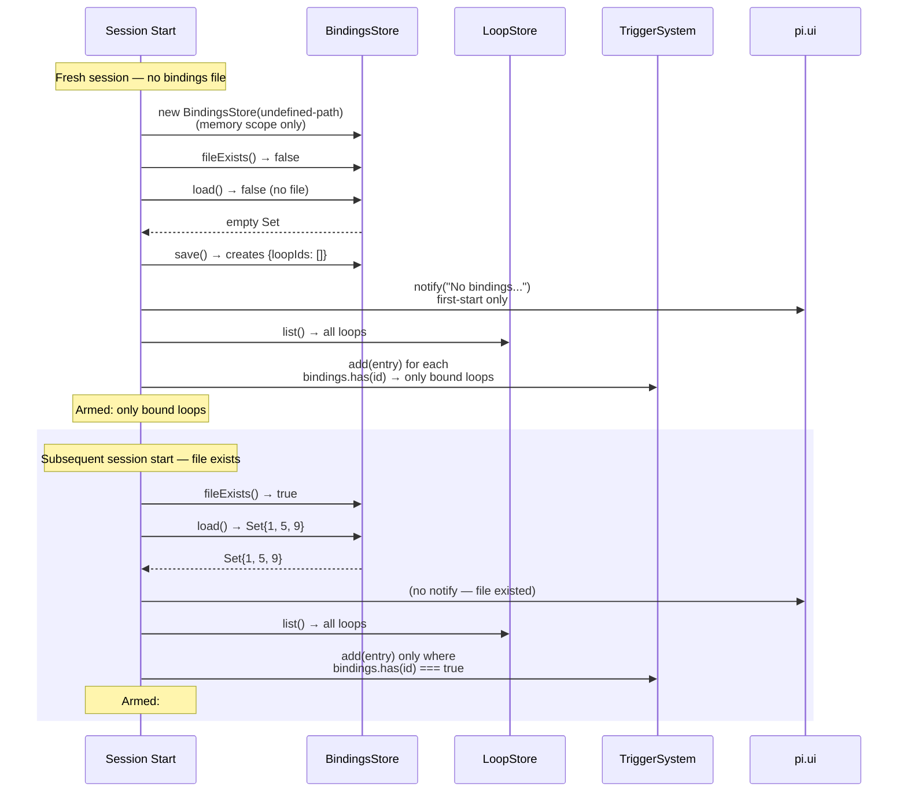

# Per-Session Loop Bindings

## Overview

Each pi terminal in the same repo can arm a **disjoint subset** of the shared loop registry without interfering with other terminals. The mechanism is a per-session bindings file at `<cwd>/.pi/loops/bindings-<sessionId>.json`.

This is the isolation layer that makes multi-terminal parallelism possible: terminal A can fire loop #5 while terminal B fires loop #7, without A's trigger subscription waking B's agent.

## Key Invariant

> Terminal A's `triggerSystem.add(#5)` does **not** cause terminal B to fire loop #5. Trigger subscriptions are process-local. Each session reads only its own bindings file.

## File Format

```json
{
  "loopIds": ["1", "3", "7"]
}
```

- One file per session, named `bindings-<sessionId>.json`
- String IDs match the LoopStore's `entries: Map<string, LoopEntry>`
- Plain JSON, no atomic-write lock — single-owner file per session
- Atomic write via `tmp → rename` (same pattern as LoopStore)

## Default: Strict Isolation

A **fresh session** (no bindings file yet) starts with **zero loops armed**. The session:

1. Loads the BindingsStore → empty Set
2. Persists an empty `{ loopIds: [] }` file so subsequent starts know we've already done the first-start notify
3. Emits one-time informational notify: `"No bindings for this session — run /loop-resume to choose which loops this terminal arms."`
4. Arms **zero** loops

This is a deliberate behavior change from prior versions, where every session armed every active loop on start.

## BindingsStore API

```typescript
// src/runtime/bindings-store.ts
class BindingsStore {
  constructor(path: string | undefined, scope: LoopScope);
  load(): boolean;      // reads file into Set; returns true if file existed; no-op for memory scope
  save(): void;          // writes {loopIds: string[]} as sorted list; no-op for memory scope
  has(id: string): boolean;
  add(id: string): void;   // add + save immediately; idempotent
  remove(id: string): void; // remove + save immediately; idempotent
  clear(): void;            // empty Set + save
  list(): string[];         // sorted snapshot
  size(): number;
  fileExists(): boolean;
  path: string | undefined;
}
```

In **memory scope**, `load`/`save`/`fileExists` are all no-ops and the Set survives only for the process lifetime.

## Workflow Diagram



## How Bindings Are Written

Bindings are written by two entry points:

### 1. `/loop-resume <id>` — One-Shot

```
Agent/User → /loop-resume 5
  → store.get("5")
  → store.resume("5")       (idempotent — sets status to active)
  → triggerSystem.add(entry) (re-binds subscription)
  → bindings.add("5")        (writes bindings-<sessionId>.json)
  → updateWidget()
  → notify("Loop #5 re-armed and bound to this session")
```

### 2. Governor Picker — `/loop-resume` (no args)

User opens Governor, toggles rows, selects `< OK>`:
```
For each pending arm:
  bindings.add(id)
  triggerSystem.add(entry)

For each pending disarm:
  bindings.remove(id)
  triggerSystem.remove(id)

bindings.save()  (once, after all changes)
notify("Armed: #1, #5 · Disarmed: #7")
```

See [Loop Governor](./loop-governor.md) for the full picker UX.

## Concurrent-Session Isolation

```mermaid
flowchart LR
    subgraph "Terminal A (sessionId=abc)"
        BA[bindings-abc.json<br/>loopIds: [1, 5]]
        TRA[triggerSystem<br/>subscribes: #1, #5]
    end

    subgraph "Terminal B (sessionId=xyz)"
        BB[bindings-xyz.json<br/>loopIds: [3, 7]]
        TRB[triggerSystem<br/>subscribes: #3, #7]
    end

    subgraph "Shared Registry"
        LS[loops.json<br/>loops #1-7]
    end

    TRA -.→|reads| BA
    TRB -. →|reads| BB
    TRA -.→|reads| LS
    TRB -. →|reads| LS
    BA -.→|writes| LS
    BB -. →|writes| LS
```

- Each terminal writes only its own `bindings-<sessionId>.json`
- Each terminal reads only its own bindings file
- The shared `loops.json` is the loop **registry** (read for loop metadata, written by LoopCreate/Delete/Update via `withLock`)
- Trigger subscriptions are process-local — no cross-terminal interference

## Session Lifecycle and Bindings

| Event | What Happens to Bindings |
|-------|------------------------|
| `session_switch` (resume) | `setSessionId(sessionId)` → correct BindingsStore path resolved → `load()` → `showPersistedLoops()` arms the right loops |
| `session_switch` (new) | Same — BindingsStore loaded from `bindings-<sessionId>.json`, arms bound loops |
| `before_agent_start` | `setSessionId` already called; `showPersistedLoops` runs; if bindings file didn't exist, empty file saved + first-start notify |
| `turn_start` | `setSessionId` called; `showPersistedLoops` skipped (already ran) |
| `session_shutdown` | Bindings file on disk untouched; next start of same sessionId reloads it |

## Relevant Files

| File | Purpose |
|------|---------|
| `src/runtime/bindings-store.ts` | BindingsStore class with atomic write, corrupt recovery |
| `src/runtime/scope.ts` | `resolveBindingsPath()` for `PI_LOOP_SCOPE` handling |
| `src/runtime/session-runtime.ts` | `showPersistedLoops()` filters arm-list by bindings |
| `src/commands/loop-command.ts` | Governor + `/loop-resume <id>` write bindings |
| `src/index.ts` | BindingsStore init, swap on `session_switch` and `setSessionId` |

## Related Flows

- [Loop Governor](./loop-governor.md) — picker UX and commit path
- [Loop Resume](./loop-resume.md) — `/loop-resume` one-shot command
- [Session Lifecycle](./session-lifecycle.md) — how bindings load on session start
