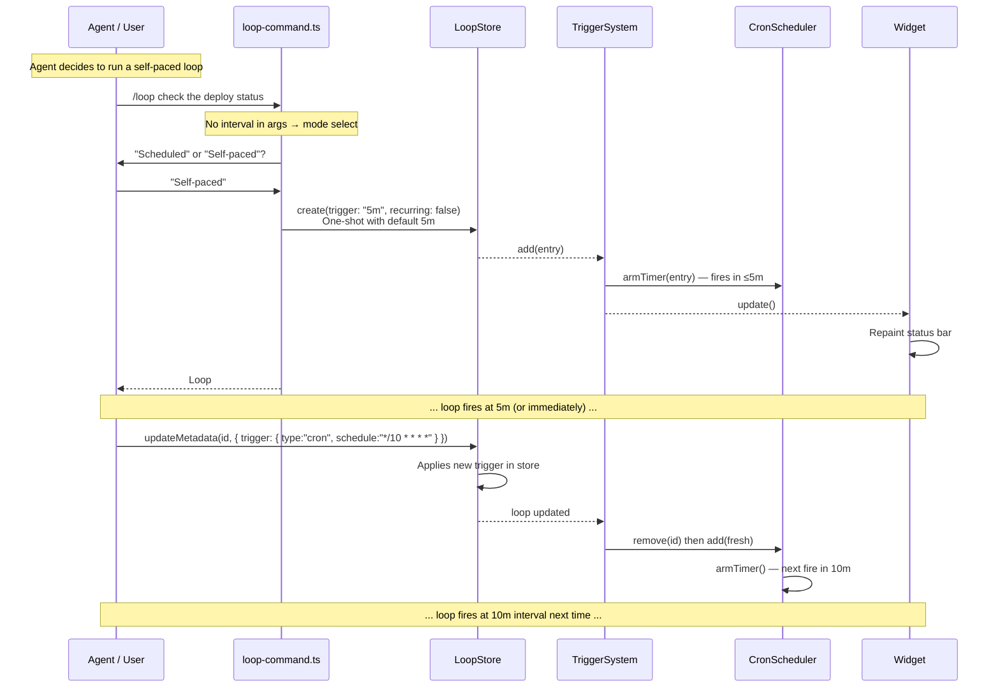

# Loop — Self-Paced Mode

> **Last reviewed:** 2026-07-04

## When to Use

User (or agent acting autonomously) wants a loop where the **next fire interval is decided dynamically after each fire** — not a fixed schedule. The agent receives a prompt, acts on it, then calls `updateMetadata` to set the next interval.

## Workflow Diagram



## Entry Points

### Via Command: `/loop <prompt>` (no interval)

1. User types `/loop check deploy status` — no interval prefix
2. Command handler (line 225) checks `intervalMatch` — no match (no leading number+unit)
3. Falls through to "Loop mode" select:
   ```
   Loop mode
   1. Scheduled: "check deploy status"
   2. Event-triggered: "check deploy status"
   ```
4. **Missing path**: Neither option leads to a "Self-paced" choice — user is forced to choose Scheduled or Event
5. Selecting "Scheduled" → `scheduleLoop(ui, trimmed)` → prompts for interval → **Enter with no input cancels**

**Gap G-L8a** → [Issue #55](https://github.com/bramburn/pi-loop/issues/55): No "Self-paced (agent decides interval)" option in the mode select. No `/loop <prompt>` shortcut that bypasses interval input.

### Via Interactive Wizard

1. `/loop` → "Create scheduled loop"
2. Prompt: "what should the agent check?" → user enters prompt
3. Interval: "what interval?" → **pressing Enter with no input cancels the flow**

**Gap G-L8b**: No "Self-paced" choice as a third option after "Create scheduled loop" / "Create event-triggered loop".

### Via Tool: LoopCreate (indirect)

Agents can programmatically create a self-paced loop:

```typescript
// Create a one-shot loop with 5-minute default trigger
LoopCreate({
  trigger: "5m",
  prompt: "check deploy status",
  recurring: false,   // one-shot
  maxFires: 1,
});
```

After the loop fires, the agent calls `LoopStore.updateMetadata()` to set the next interval:

```typescript
// In tool or runtime:
store.updateMetadata("N", {
  trigger: { type: "cron", schedule: "*/10 * * * *" },  // 10-minute interval
  prompt: "check deploy status — updated",
});
```

This path works — `updateMetadata` updates the store, then `TriggerSystem` calls `CronScheduler.remove(id)` + `CronScheduler.add(fresh)` to re-arm the timer with the new schedule.

## Data Structures

```typescript
// Initial self-paced loop (one-shot)
const entry: LoopEntry = {
  id: "N",
  prompt: "check deploy status",
  trigger: { type: "cron", schedule: "*/5 * * * *" }, // 5-minute default
  status: "active",
  recurring: false,       // one-shot
  maxFires: 1,            // auto-delete after one fire
  fireCount: 0,
  createdAt: Date.now(),
  updatedAt: Date.now(),
  expiresAt: Date.now() + 7 * 24 * 60 * 60 * 1000,
};

// After agent calls updateMetadata — new state
{
  ...entry,
  trigger: { type: "cron", schedule: "*/10 * * * *" }, // new interval
  recurring: true,        // agent can set to recurring
  maxFires: undefined,    // or set a cap
  updatedAt: Date.now(),
}
```

## UpdateMetadata Flow (Re-arm)

```typescript
// src/store.ts:108
updateMetadata(id, fields) {
  return this.withLock(() => {
    // ...
    if (fields.trigger) {
      this.applyReducerEvent({
        type: "LOOP_UPDATED",
        at: Date.now(),
        source: "tool",
        entityType: "loop",
        entityId: id,
        payload: { trigger: fields.trigger, prompt: fields.prompt },
      });
      // LoopStore fires "loop:updated" event
    }
    return { entry: this.entries.get(id), changedFields };
  });
}
```

The `"LOOP_UPDATED"` event triggers `TriggerSystem` to re-arm:

```typescript
// src/trigger-system.ts (onLoopUpdated callback)
this.remove(id);
const fresh = this.store.get(id);
if (fresh) this.add(fresh);  // Re-arms with new cron schedule
```

## Safety Options

| Option | Purpose | Note |
|--------|---------|------|
| `recurring: false, maxFires: 1` | One-shot with agent-driven reschedule | Default for self-paced |
| `readOnly: true` | Restrict to read-only tools | Agent cannot modify repo |
| `maxFires: N` | Cap total fires | Falls back to `pump()` guard |

## Exit Conditions

1. Loop fires (cron matches or 5m default fires)
2. Agent receives wake prompt
3. Agent performs action, then calls `updateMetadata(id, { trigger: newCron })`
4. TriggerSystem re-arms with new interval → loop continues on new schedule

## Gaps Identified

### G-L8a → [GitHub Issue #55](https://github.com/bramburn/pi-loop/issues/55) (Medium): No "Self-paced" option in `/loop <prompt>` mode select

**Current behavior**: `/loop <prompt>` with no interval forces user through "Scheduled" or "Event-triggered" selection, then requires an interval.

**Expected behavior**: When no interval is detected and prompt is non-empty, offer a third option:
```
Loop mode
1. Scheduled: "check deploy status"
2. Event-triggered: "check deploy status"
3. Self-paced (agent decides interval)
```

### G-L8b → [GitHub Issue #58](https://github.com/bramburn/pi-loop/issues/58) (Medium): No "Self-paced" option in `/loop` interactive wizard

**Current behavior**: "Create scheduled loop" requires an interval; pressing Enter with no input cancels.

**Expected behavior**: Top-level menu should have a fourth option:
```
Loop
1. Create scheduled loop
2. Create event-triggered loop
3. Create self-paced loop      ← MISSING
4. View loops
```

And "Create self-paced loop" should:
1. Prompt for the prompt ✓
2. Create loop with `recurring: false, maxFires: 1, trigger: "5m"` (no interval prompt)
3. Ask "Start now?" → fires immediately so agent can decide first interval

### G-L8c (Low): No `LoopUpdate` tool exposes `updateMetadata`

`updateMetadata` is the only way for an agent to dynamically reschedule a loop, but there is no `LoopUpdate` tool. Agents must call it internally or via a custom tool. See G-01 in `userflow/GAPS.md`.

## Relevant Files

| File | Purpose |
|------|---------|
| `src/commands/loop-command.ts` | `/loop` command — missing self-paced paths (G-L8a, G-L8b) |
| `src/store.ts:108` | `updateMetadata()` — the reschedule mechanism |
| `src/trigger-system.ts` | Re-arms timer on `"LOOP_UPDATED"` event |
| `src/scheduler.ts:50` | `armTimer()` — sets next fire from `trigger.schedule` |
| `src/loop-parse.ts` | `parseInterval()` — parses `"5m"` → cron |
| `AGENTS.md` | Self-paced mode documented but not fully wired in UI |
