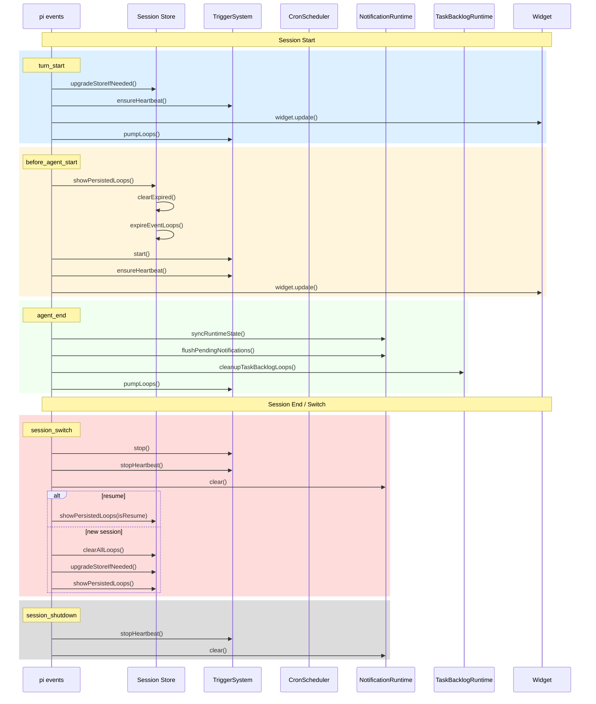
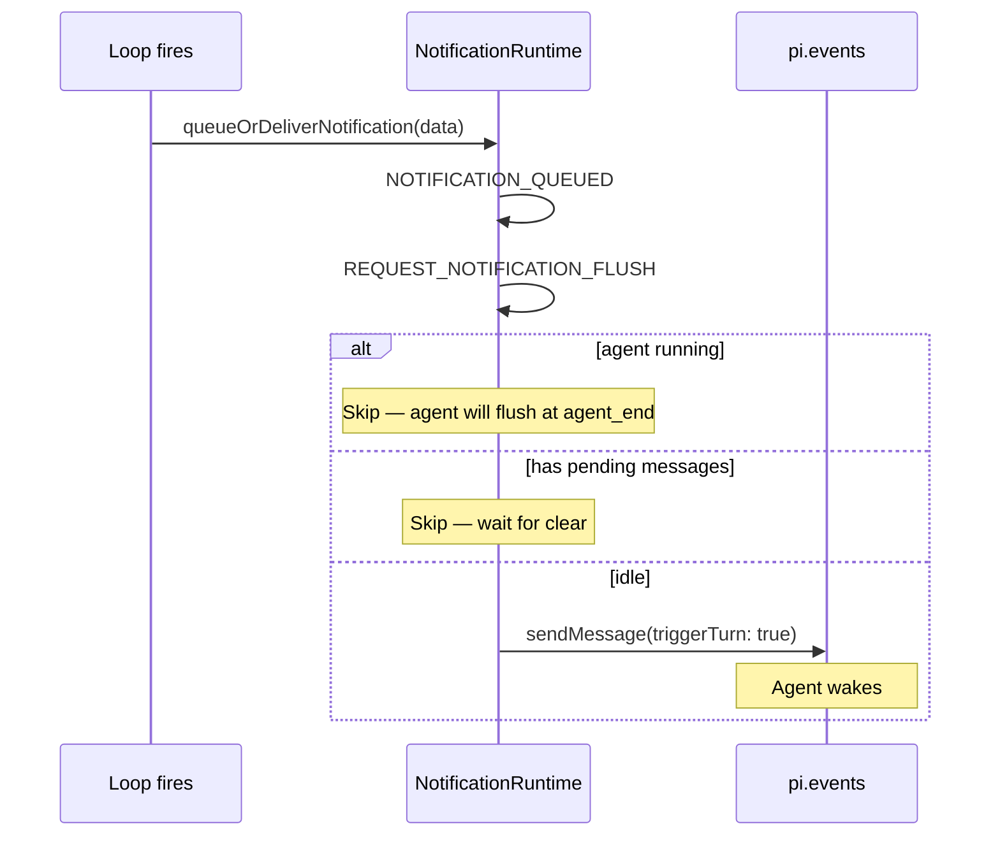

# Session Lifecycle

## Overview

pi-loop manages loops and monitors across session boundaries. The session lifecycle handles store recreation, trigger management, and notification delivery across `turn_start`, `before_agent_start`, `agent_end`, `session_switch`, and `session_shutdown` events.

## Event Flow Diagram



## Event Details

### `turn_start`

Fires on every agent turn. Initializes the session store and triggers the heartbeat timer.

```typescript
// src/runtime/session-runtime.ts
pi.on("turn_start", async (_event, ctx) => {
  upgradeStoreIfNeeded(ctx);      // Recreate session store
  ensureHeartbeat();               // Start 30s heartbeat
  widget.update();
  await pumpLoops();               // Check for due cron fires
});
```

### `before_agent_start`

First turn of a session. Shows persisted loops and starts the trigger system.

```typescript
pi.on("before_agent_start", async (_event, ctx) => {
  upgradeStoreIfNeeded(ctx);
  ensureHeartbeat();
  showPersistedLoops();           // Expires stale + starts triggers
  widget.update();
});
```

### `agent_end`

End of each agent turn. Flushes notifications and evaluates the task backlog.

```typescript
pi.on("agent_end", async (_event, ctx) => {
  notificationRuntime.syncRuntimeState({ agentRunning: false, hasPendingMessages: ... });
  await flushPendingNotifications({ ignorePendingMessages: true });
  await cleanupTaskBacklogLoops();
  await pumpLoops();
});
```

### `session_switch`

Fires when switching between sessions. Stops all triggers, clears notifications.

```typescript
pi.on("session_switch" as never, async (event, ctx) => {
  getTriggerSystem().stop();      // Stop cron + unsubscribe events
  stopHeartbeat();                // Stop 30s timer
  notificationRuntime.clear("session_switch");
  setSessionId(undefined);

  const isResume = event?.reason === "resume";
  if (!isResume && getLoopScope() === "memory") {
    clearAllLoops();
  }

  upgradeStoreIfNeeded(ctx);
  showPersistedLoops(isResume);
  widget.update();
});
```

### `session_shutdown`

Final cleanup when the session ends.

```typescript
pi.on("session_shutdown", async () => {
  stopHeartbeat();
  notificationRuntime.clear("session_shutdown");
});
```

## Loop Expiry on Resume

When a session resumes (`isResume: true`), old event loops are expired because they were created in a different session context and may have stale state:

```mermaid
flowchart TD
    A[Session Resume] --> B[expireEventLoops]
    B --> C{Loop type}
    C -->|event| D[LOOP_EXPIRED<br/>Delete from store]
    C -->|hybrid| D
    C -->|cron| E[Keep<br/>Re-arm timer]
    D --> F[BUG: Trigger not removed!]
    Note over F: G-06: event subscription leaks
```

**Important**: `expireEventLoops()` deletes the loop from the store but does NOT call `triggerSystem.remove()`. See [GAPS.md](./GAPS.md) G-06.

## Store Scope Resolution

```mermaid
flowchart LR
    A[pi-loop env] --> B{PI_LOOP env set?}
    B -->|Yes| C[Project or Memory scope]
    B -->|No| D{Session scope}
    
    D --> E[Session ID based<br/>.pi/loops/session-{id}.json]
    C --> F[Fixed path<br/>.pi/loops/]
```

| Scope | Path | Behavior |
|-------|------|----------|
| `memory` | In-memory only | Cleared on session switch |
| `session` | `~/.pi/loops/session-{id}.json` | Recreated per session |
| `project` | `.pi/loops/` relative to CWD | Persistent across sessions |

## Notification Delivery

Loops fire → notification queued → delivered when agent is idle (`agent_end` or `before_agent_start`):



## Relevant Files

| File | Purpose |
|------|---------|
| `src/runtime/session-runtime.ts` | All session lifecycle hooks |
| `src/runtime/notification-runtime.ts` | Notification queue and delivery |
| `src/runtime/task-backlog-runtime.ts` | Task backlog cleanup |
| `src/scheduler.ts` | CronScheduler.start/stop |
| `src/trigger-system.ts` | TriggerSystem.start/stop |
| `src/store.ts` | clearExpired, expireEventLoops, clearAll |

## Related Flows

- [Loop Create — Cron Trigger](./loop-create-cron.md)
- [Loop Create — Event Trigger](./loop-create-event.md)
- [Auto Task Worker Loop](./auto-task-worker.md)
