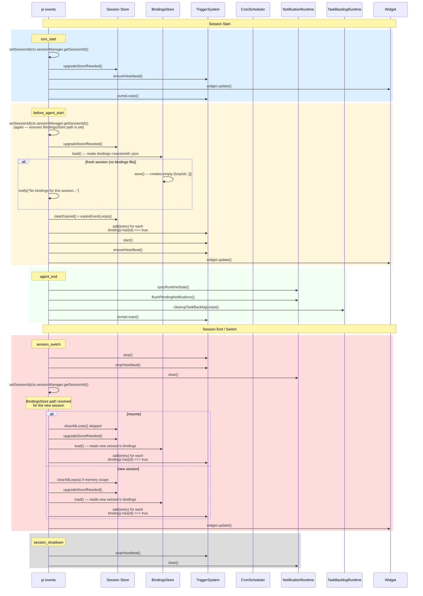
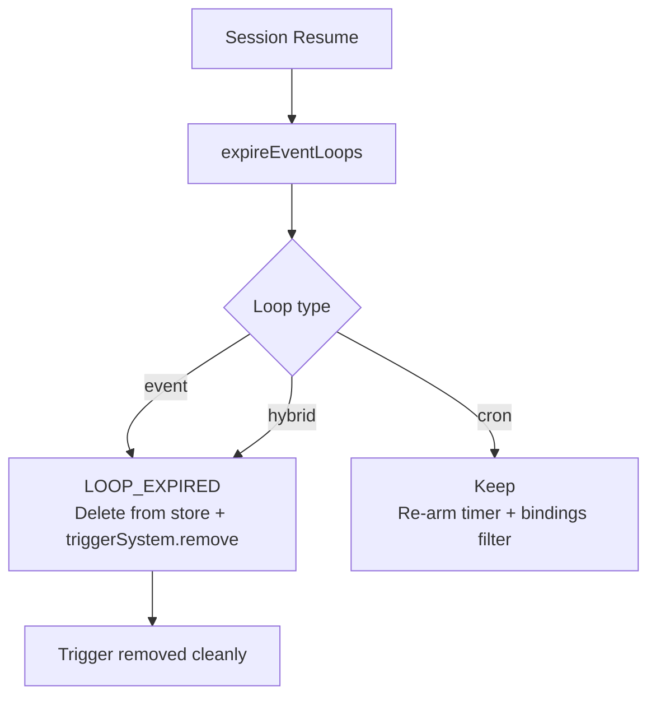
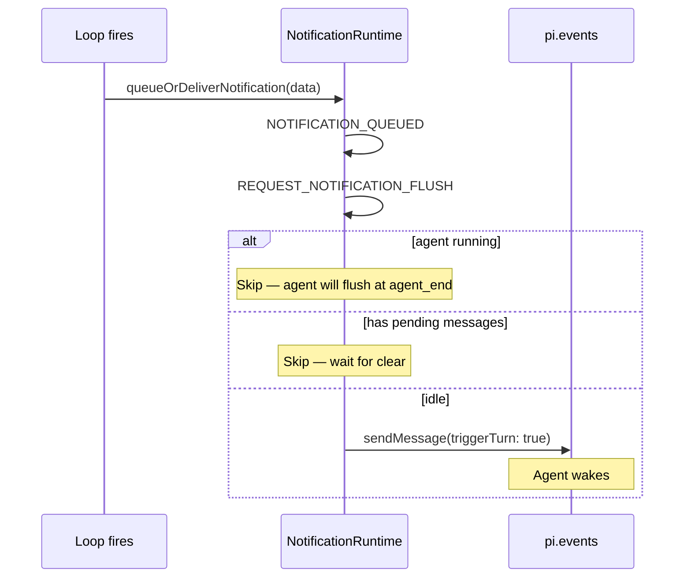

# Session Lifecycle

## Overview

pi-loop manages loops and monitors across session boundaries. The session lifecycle handles store recreation, per-session bindings loading, trigger management, and notification delivery across `turn_start`, `before_agent_start`, `agent_end`, `session_switch`, and `session_shutdown` events.

## Event Flow Diagram



## Event Details

### `turn_start`

Fires on every agent turn. Initializes the session store and triggers the heartbeat timer.

```typescript
// src/runtime/session-runtime.ts
pi.on("turn_start", async (_event, ctx) => {
  setSessionId(ctx.sessionManager.getSessionId());  // Refresh BindingsStore path
  upgradeStoreIfNeeded(ctx);                        // Recreate session store
  ensureHeartbeat();                                // Start 30s heartbeat
  widget.update();
  await pumpLoops();                                // Check for due cron fires
});
```

### `before_agent_start`

First turn of a session. Loads bindings, expires stale loops, and arms only the bound loops.

```typescript
pi.on("before_agent_start", async (_event, ctx) => {
  setSessionId(ctx.sessionManager.getSessionId());  // Ensure correct BindingsStore path
  upgradeStoreIfNeeded(ctx);
  ensureHeartbeat();
  showPersistedLoops();                             // Load bindings + arm bound loops
  widget.update();
});
```

`showPersistedLoops()`:
1. Checks if bindings file exists (`bindings.fileExists()`)
2. Loads bindings (`bindings.load()`) → populates the in-memory Set
3. If fresh session (no file): saves empty `{loopIds: []}` + emits first-start notify
4. Filters `store.list()` by `bindings.has(entry.id)`
5. Calls `triggerSystem.add(entry)` for each bound loop
6. Calls `triggerSystem.start()` + `ensureHeartbeat()` if any loops are bound

### `agent_end`

End of each agent turn. Flushes notifications and evaluates the task backlog.

```typescript
pi.on("agent_end", async (_event, ctx) => {
  notificationRuntime.syncRuntimeState({ agentRunning: false, hasPendingMessages: ... });
  await flushPendingNotifications({ ignorePendingMessages: true });
  await cleanupTaskBacklogLoops();
  await pumpLoops();
});
```

### `session_switch`

Fires when switching between sessions. Stops all triggers, clears notifications, and loads the new session's bindings.

```typescript
pi.on("session_switch" as never, async (event, ctx) => {
  getTriggerSystem().stop();      // Stop cron + unsubscribe events
  stopHeartbeat();                // Stop 30s timer
  notificationRuntime.clear("session_switch");

  const isResume = event?.reason === "resume";
  storeUpgraded = false;
  persistedShown = false;

  if (!isResume && getLoopScope() === "memory") {
    clearAllLoops();
  }

  // Set sessionId BEFORE showPersistedLoops so the BindingsStore
  // path is resolved correctly and the right bindings are loaded.
  setSessionId(ctx.sessionManager.getSessionId());

  upgradeStoreIfNeeded(ctx);
  showPersistedLoops(isResume);
  widget.update();
});
```

**Key:** `setSessionId` is called with the **real** sessionId (not `undefined`) before `showPersistedLoops`, so the BindingsStore is resolved to the correct `bindings-<sessionId>.json` path before loading.

### `session_shutdown`

Final cleanup when the session ends.

```typescript
pi.on("session_shutdown", async () => {
  stopHeartbeat();
  notificationRuntime.clear("session_shutdown");
});
```

## Per-Session Bindings

On session start, the BindingsStore is loaded from `bindings-<sessionId>.json`:

```mermaid
flowchart TD
    A[Session Start] --> B{bindings-<sessionId>.json exists?}
    B -->|No (fresh)| C[Load → empty Set]
    C --> D[Save {loopIds: []}]
    D --> E[Emit first-start notify]
    E --> F[Arm zero loops<br/>strict isolation]
    B -->|Yes| G[Load {loopIds: [1,5,9]}]
    G --> H[Arm only loops #1, #5, #9]
    F --> I[Done]
    H --> I
```

See [Per-Session Bindings](./per-session-bindings.md) for the full bindings mechanism.

## Loop Expiry on Resume

When a session resumes (`isResume: true`), old event loops are expired because they were created in a different session context and may have stale state:



**Important**: `expireEventLoops()` deletes the loop from the store **and** calls `triggerSystem.remove(id)`. This is G-06 from GAPS.md — event subscription leaks are prevented by the explicit removal.

## Store Scope Resolution

```mermaid
flowchart LR
    A[pi-loop env] --> B{PI_LOOP env set?}
    B -->|Yes| C[Custom path]
    B -->|No| D{PI_LOOP_SCOPE}
    D -->|memory| E[In-memory only<br/>Cleared on switch]
    D -->|session| F[bindings-<sessionId>.json<br/>loops-<sessionId>.json]
    D -->|project (default)| G[.pi/loops/bindings-<sessionId>.json<br/>.pi/loops/loops.json<br/>Shared across sessions]
```

| Scope | Loop Store Path | Bindings Path |
|-------|----------------|---------------|
| `memory` | In-memory only | In-memory only (no file) |
| `session` | `.pi/loops/loops-<sessionId>.json` | `.pi/loops/bindings-<sessionId>.json` |
| `project` (default) | `.pi/loops/loops.json` | `.pi/loops/bindings-<sessionId>.json` |

## Notification Delivery

Loops fire → notification queued → delivered when agent is idle (`agent_end` or `before_agent_start`):



## Relevant Files

| File | Purpose |
|------|---------|
| `src/runtime/session-runtime.ts` | All session lifecycle hooks, `showPersistedLoops` |
| `src/runtime/bindings-store.ts` | BindingsStore for per-session loop bindings |
| `src/runtime/scope.ts` | `resolveLoopStorePath`, `resolveBindingsPath` |
| `src/runtime/notification-runtime.ts` | Notification queue and delivery |
| `src/runtime/task-backlog-runtime.ts` | Task backlog cleanup |
| `src/scheduler.ts` | CronScheduler.start/stop |
| `src/trigger-system.ts` | TriggerSystem.start/stop |
| `src/store.ts` | clearExpired, expireEventLoops, clearAll |

## Related Flows

- [Per-Session Bindings](./per-session-bindings.md)
- [Loop Governor](./loop-governor.md)
- [Loop Resume](./loop-resume.md)
- [Loop Create — Cron Trigger](./loop-create-cron.md)
- [Loop Create — Event Trigger](./loop-create-event.md)
- [Auto Task Worker Loop](./auto-task-worker.md)
