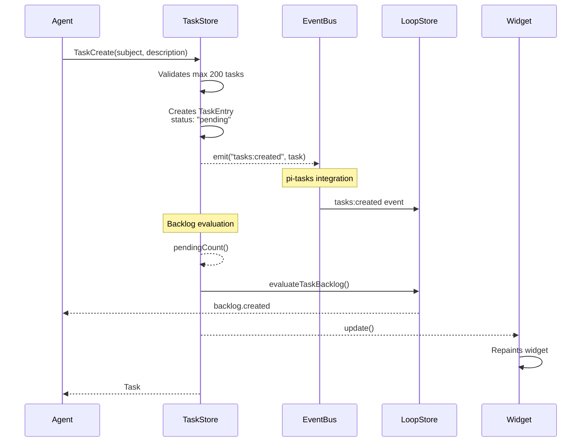
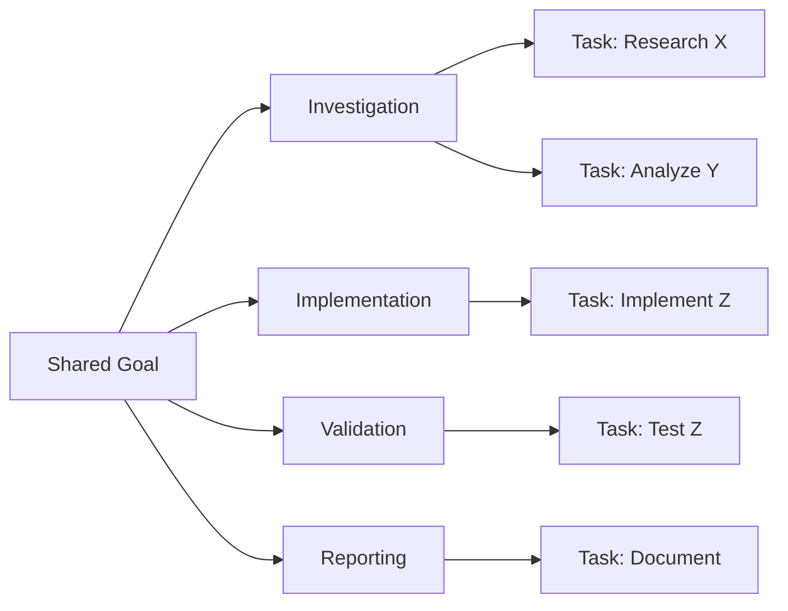
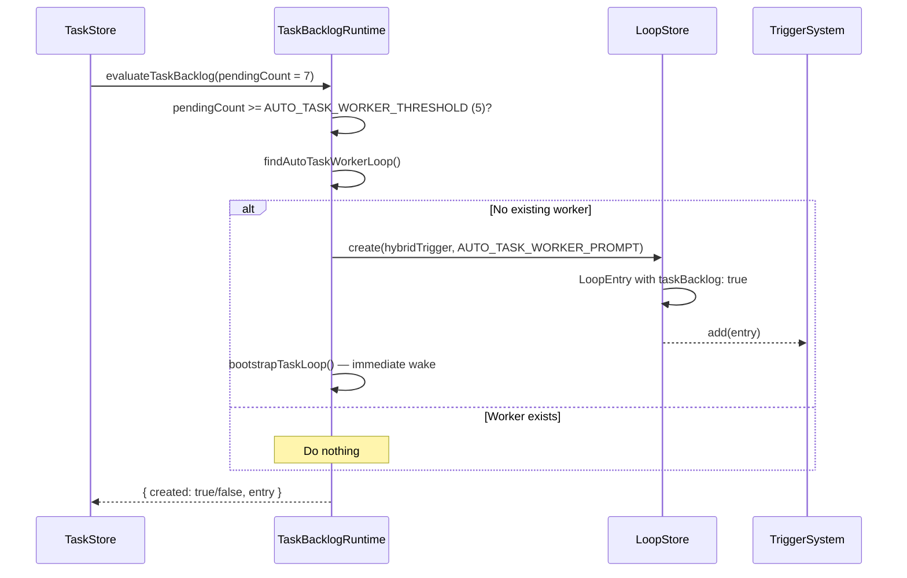

# Task Create

## When to Use

- User wants to break down a complex goal into trackable pieces
- User wants to decompose a broad goal into a concrete backlog
- User needs to track progress across multiple turns
- User wants to establish shared goals across multiple tasks

## Workflow Diagram



## Entry Points

### Via Tool: `TaskCreate`

1. Agent calls `TaskCreate` with:
   - `subject`: brief actionable title
   - `description`: detailed requirements and done condition

2. System:
   - Validates max 200 tasks limit
   - Creates TaskEntry with status `pending`
   - Emits `tasks:created` event
   - Evaluates task backlog (may create backlog worker loop)
   - Updates widget

3. Returns task ID for tracking

### Via Command: `/tasks`

1. User types `/tasks` with optional subject

2. If subject provided:
   - Creates task directly
   - Evaluates backlog

3. If no subject:
   - Shows interactive menu
   - "Create task" option

### Via Interactive Menu

1. User selects "+ Create task"

2. Prompts for:
   - Subject (title)
   - Description (details)

3. Same creation flow

## Data Structure

```typescript
// src/task-types.ts
interface TaskEntry {
  id: string;
  subject: string;           // Brief actionable title
  description: string;        // Detailed requirements
  status: "pending" | "in_progress" | "completed";
  createdAt: number;           // Unix timestamp
  updatedAt: number;           // Unix timestamp
  completedAt?: number;        // Unix timestamp
  metadata?: Record<string, unknown>;
}

interface TaskStoreData {
  nextId: number;
  tasks: TaskEntry[];
}
```

## Task Decomposition Guidelines

When creating multiple tasks for a shared goal:



## Subject vs Description

| Field | Purpose | Guidelines |
|-------|---------|------------|
| Subject | Quick identification | Short, verb-object (e.g., "Write tests for auth") |
| Description | Detailed context | Include expected artifact, outcome, done condition |

## Auto Task Worker Loop

When `evaluateTaskBacklog()` triggers and `pendingCount >= 5`, the system automatically creates an **Auto Task Worker Loop**:



### AUTO_TASK_WORKER_PROMPT

```typescript
// src/runtime/task-backlog-runtime.ts
export const AUTO_TASK_WORKER_THRESHOLD = 5;

export const AUTO_TASK_WORKER_PROMPT =
  "Run TaskList, pick next pending task, mark it in_progress, " +
  "implement it, run validation, complete it. " +
  "If no pending tasks remain, call LoopDelete on your own loop ID.";
```

### Properties

| Field | Value |
|-------|-------|
| `trigger.type` | `hybrid` |
| `trigger.cron` | `*/5 * * * *` |
| `trigger.event.source` | `tasks:created` |
| `trigger.debounceMs` | `30000` |
| `recurring` | `true` |
| `taskBacklog` | `true` |
| `maxFires` | `30` |

### Auto-Cleanup

When all tasks are completed and `cleanupTaskBacklogLoops()` is called (e.g., on `agent_end`), the auto worker loop is deleted:

```
pendingCount = 0 → cleanupTaskBacklogLoops() → removeTrigger(id) + deleteLoop(id)
```

See [Auto Task Worker Loop](./auto-task-worker.md) for full details.

## Relevant Files

| File | Purpose |
|------|---------|
| `src/task-types.ts` | TaskEntry data structure |
| `src/task-store.ts` | TaskStore.create() |
| `src/tools/native-task-tools.ts` | TaskCreate tool |
| `src/commands/tasks-command.ts` | /tasks command |
| `src/runtime/task-backlog-runtime.ts` | Backlog evaluation |

## Related Flows

- [Task List](./task-list.md)
- [Task Update](./task-update.md)
- [Task Delete](./task-delete.md)
