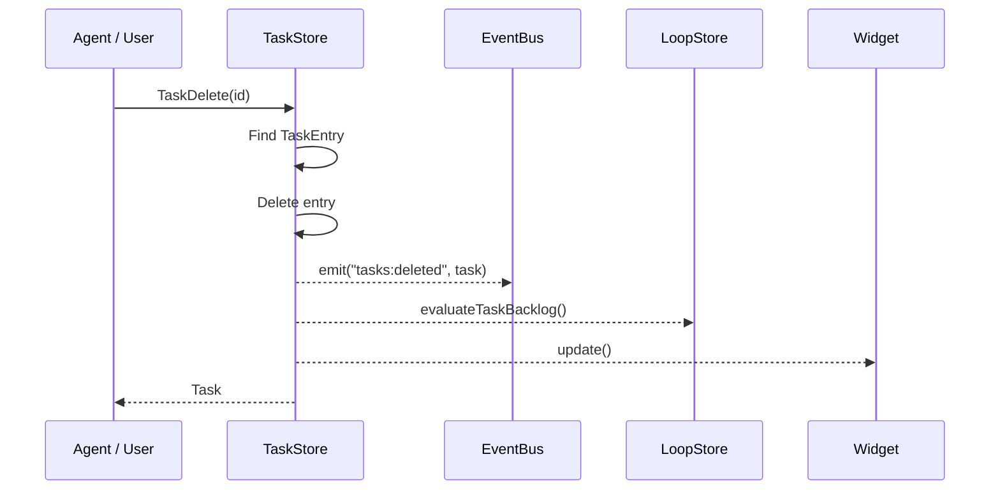
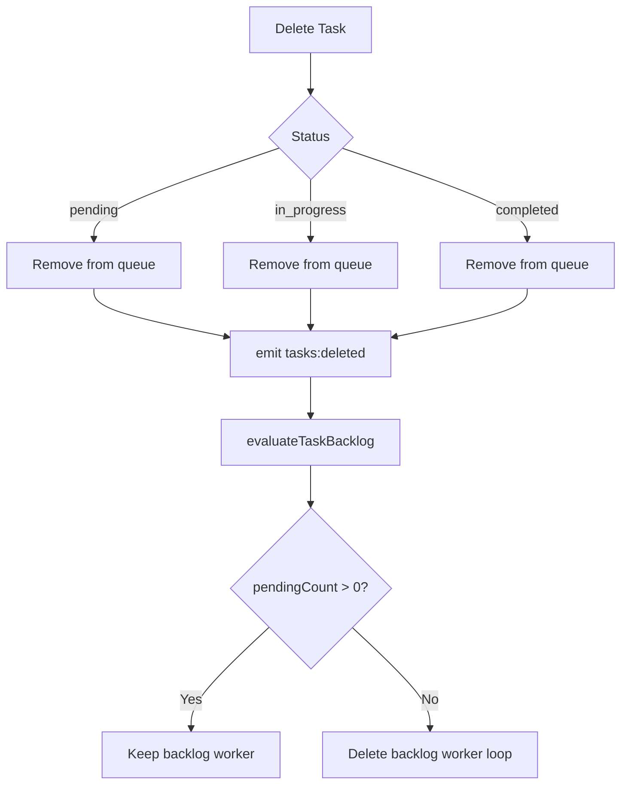

# Task Delete

## When to Use

- User wants to remove a completed task from the backlog
- User created a task by mistake
- User realizes a task is no longer needed
- Cleaning up after a project phase

## Workflow Diagram



## Entry Point

### Via Tool: `TaskDelete`

1. Agent calls `TaskDelete({ id: "123" })`

2. System:
   - Finds task by ID
   - Deletes entry from TaskStore
   - Emits `tasks:deleted` event with original task
   - Evaluates backlog (may affect backlog worker loop)
   - Updates widget

3. Returns confirmation or "not found"

### Via Interactive Menu

1. User selects task from `/tasks` menu

2. Chooses "x Delete"

3. Same flow as tool call

## Data Structure

```typescript
// src/task-types.ts
interface TaskEntry {
  id: string;
  subject: string;
  description: string;
  status: "pending" | "in_progress" | "completed";
  createdAt: number;
  updatedAt: number;
  completedAt?: number;
  metadata?: Record<string, unknown>;
}
```

## Deletion Behavior



## Important Parameter Name

> **Note**: The parameter is `id`, NOT `taskId`.

```typescript
// ✅ Correct
TaskDelete({ id: "1" })

// ❌ Wrong - will fail
TaskDelete({ taskId: "1" })
```

## Relevant Files

| File | Purpose |
|------|---------|
| `src/task-store.ts` | TaskStore.delete() |
| `src/task-types.ts` | TaskEntry structure |
| `src/tools/native-task-tools.ts` | TaskDelete tool |
| `src/runtime/task-events.ts` | Event emission |

## Related Flows

- [Task Create](./task-create.md)
- [Task List](./task-list.md)
- [Task Update](./task-update.md)
