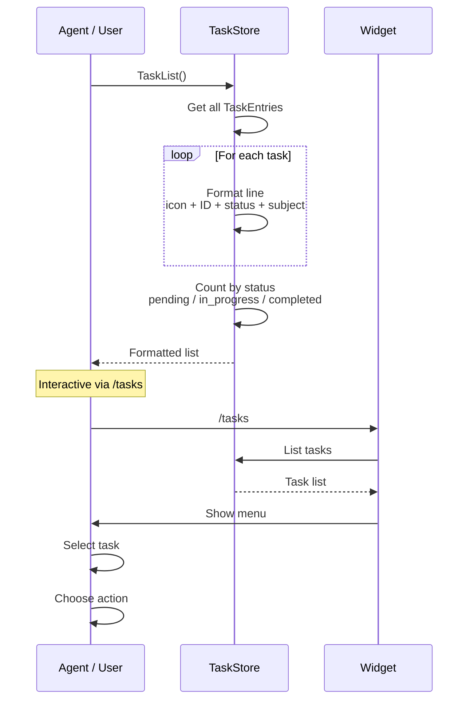
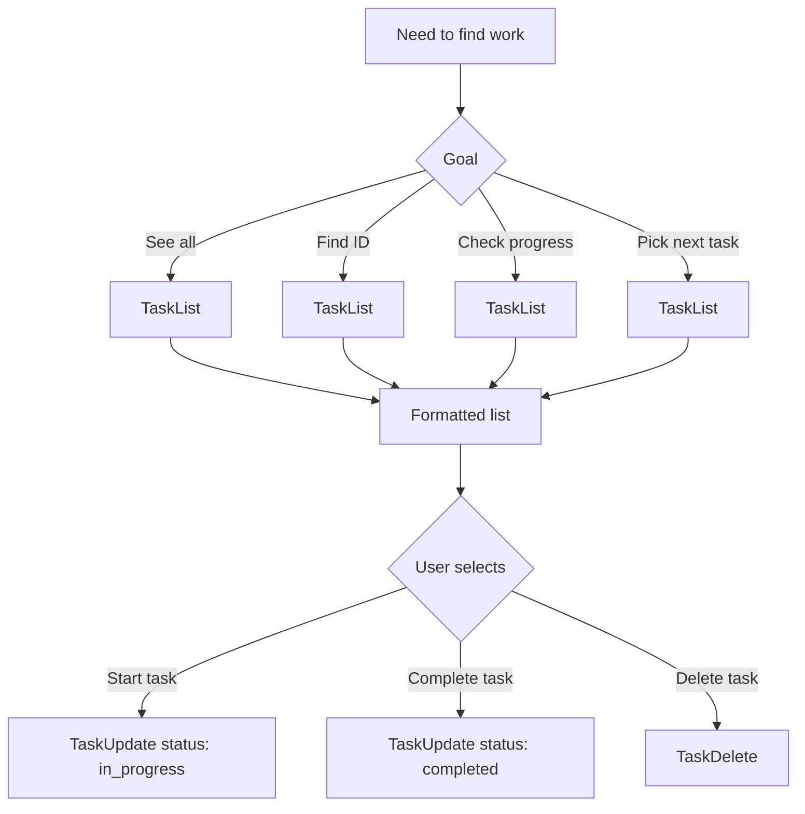

# Task List

## When to Use

- User wants to see all tasks and their status
- Agent needs to find tasks to work on
- User wants to check progress across the backlog
- Finding a task ID for update/delete operations

## Workflow Diagram



## Entry Point

### Via Tool: `TaskList`

1. Agent or user calls `TaskList` (no parameters)

2. System retrieves all tasks from TaskStore

3. Returns formatted list showing:
   - Status icon (`*` pending, `>` in_progress, `ok` completed)
   - Task ID (`#123`)
   - Status badge
   - Subject (truncated to 80 chars)

4. Summary line shows counts by status

## Output Format

```
4 tasks (2 pending, 1 in progress, 1 done)
* #1 [pending] Research authentication library
> #2 [in_progress] Implement OAuth2 flow
ok #3 [completed] Set up project structure
* #4 [pending] Write unit tests for auth module
```

## Status Icons

| Icon | Status | Color | Meaning |
|------|--------|-------|---------|
| `*` | pending | Neutral | Task queued for work |
| `>` | in_progress | Active | Work started |
| `ok` | completed | Success | Task done |

## Data Structure

```typescript
// src/task-types.ts
interface TaskEntry {
  id: string;
  subject: string;
  description: string;
  status: "pending" | "in_progress" | "completed";
  createdAt: number;
  updatedAt: number;
  completedAt?: number;
  metadata?: Record<string, unknown>;
}

interface TaskStoreData {
  nextId: number;
  tasks: TaskEntry[];
}
```

## Use Cases



## Relevant Files

| File | Purpose |
|------|---------|
| `src/task-store.ts` | TaskStore.list() |
| `src/task-types.ts` | TaskEntry structure |
| `src/tools/native-task-tools.ts` | TaskList tool |
| `src/commands/tasks-command.ts` | /tasks command |

## Related Flows

- [Task Create](./task-create.md)
- [Task Update](./task-update.md)
- [Task Delete](./task-delete.md)
