# Task-Loop Interaction

## Overview

Tasks and loops have a bidirectional relationship managed by two runtime systems:

- **TaskBacklogRuntime** (`src/runtime/task-backlog-runtime.ts`): Manages the auto task worker loop lifecycle
- **TaskRuntimeBridge** (`src/runtime/task-rpc.ts`): Bridges native tasks and pi-tasks for task creation from loops

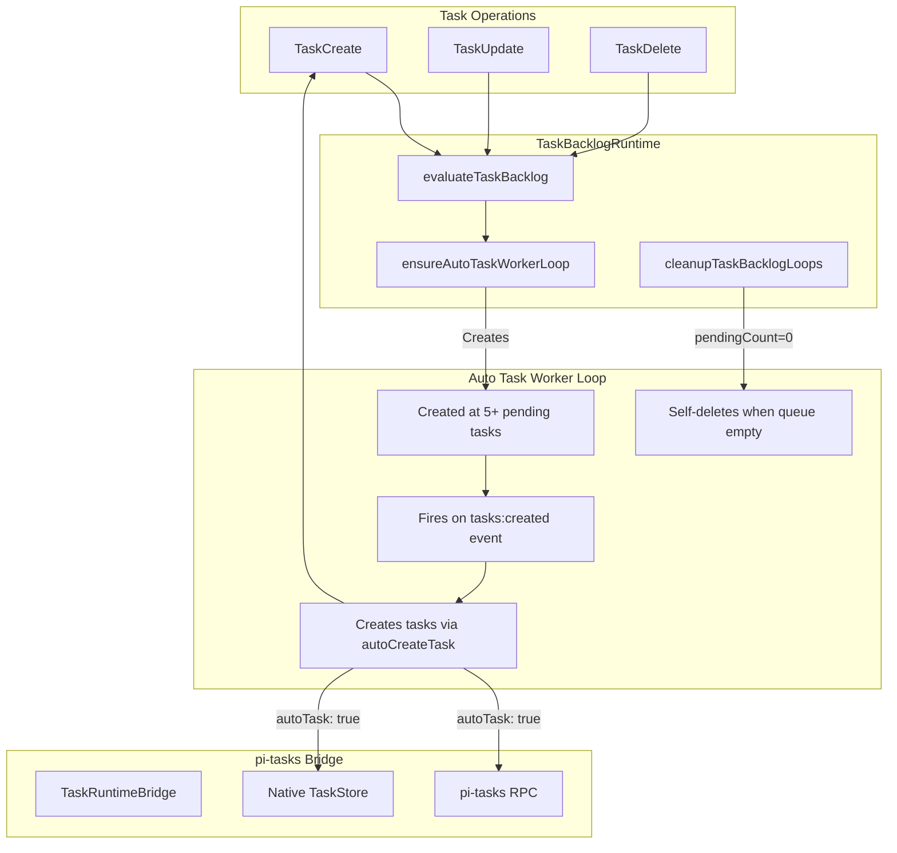

## The Two Interaction Patterns

### Pattern A: Loop Creates Task (autoTask)

When a loop has `autoTask: true`, it creates a task each time it fires:

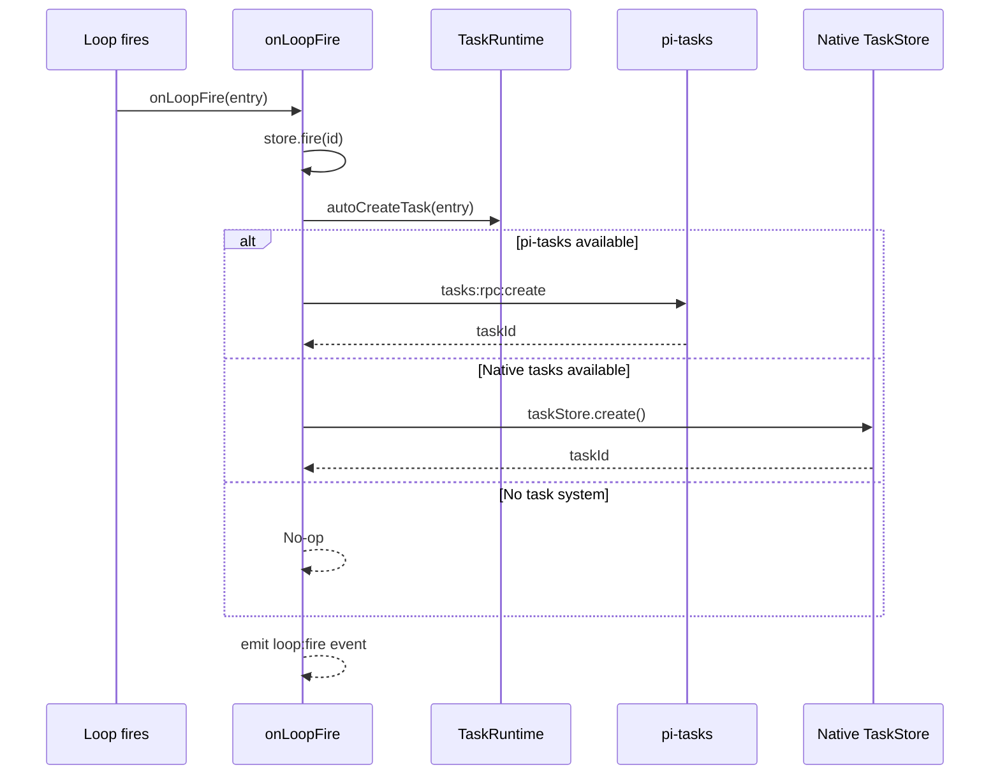

```typescript
// src/index.ts - onLoopFire
function onLoopFire(entry: LoopEntry): void {
  if (atMaxFires(entry)) {
    store.delete(entry.id);
    return;
  }
  store.fire(entry.id);

  if (entry.autoTask) {
    autoCreateTask(entry).then((taskId) => {
      if (taskId) debug(`loop #${entry.id} → task #${taskId}`);
    });
  }

  pi.events.emit("loop:fire", { loopId: entry.id, ... });
}
```

### Pattern B: Task Triggers Loop (backlog worker)

When 5+ pending tasks exist, an auto task worker loop is created that fires on `tasks:created` events:

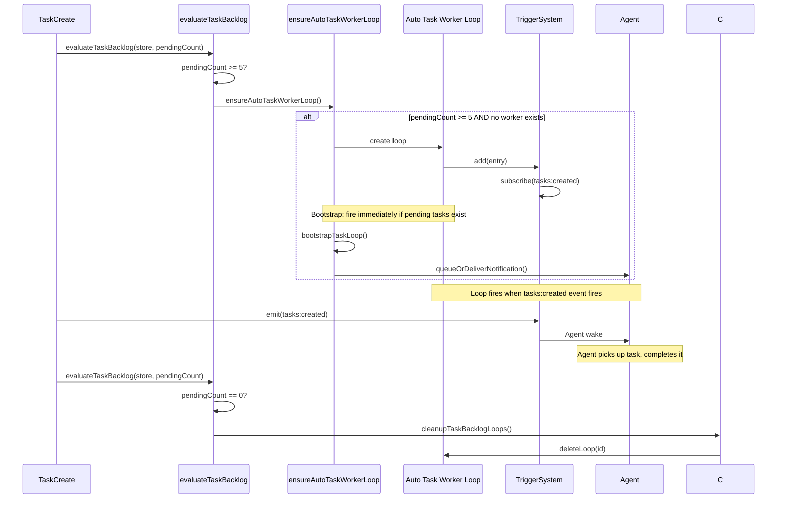

## Event Flow Diagram

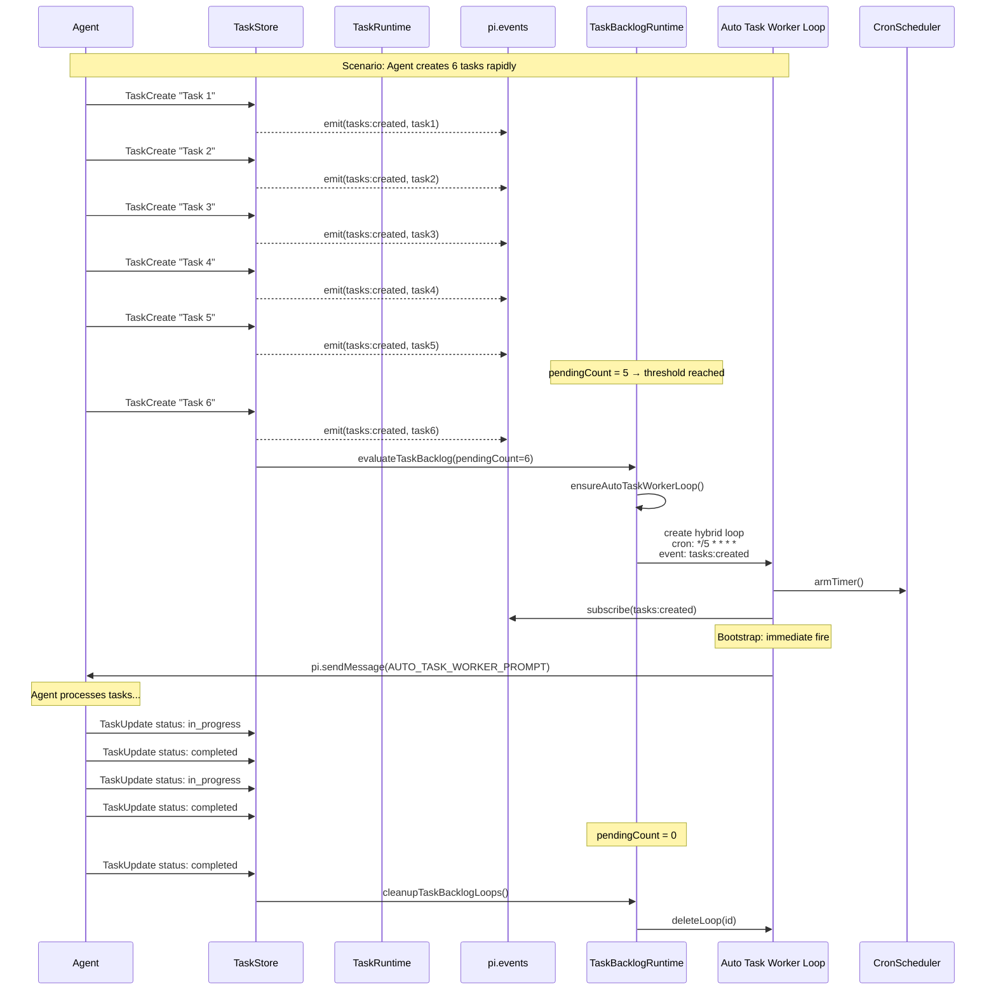

## Key Data Structures

### Loop Entry (when used as task worker)

```typescript
// src/runtime/task-backlog-runtime.ts
const AUTO_TASK_WORKER_PROMPT =
  "Run TaskList, pick next pending task, mark it in_progress, " +
  "implement it, run validation, complete it. " +
  "If no pending tasks remain, call LoopDelete on your own loop ID.";

interface AutoTaskWorkerLoop {
  trigger: {
    type: "hybrid";
    cron: "*/5 * * * *";
    event: {
      source: "tasks:created";
    };
    debounceMs: 30000;
  };
  prompt: AUTO_TASK_WORKER_PROMPT;
  recurring: true;
  taskBacklog: true;
  maxFires: 30;
  autoTask: false;  // Worker creates tasks manually via prompts
}
```

### Task Metadata (when created by loop)

```typescript
// src/runtime/task-rpc.ts
interface AutoCreatedTask {
  subject: string;  // Truncated from loop.prompt (first 80 chars)
  description: `Auto-created from loop #${loopId}`;
  metadata: {
    loopId: string;
    trigger: Trigger;
  };
}
```

## Backlog Evaluation State Machine

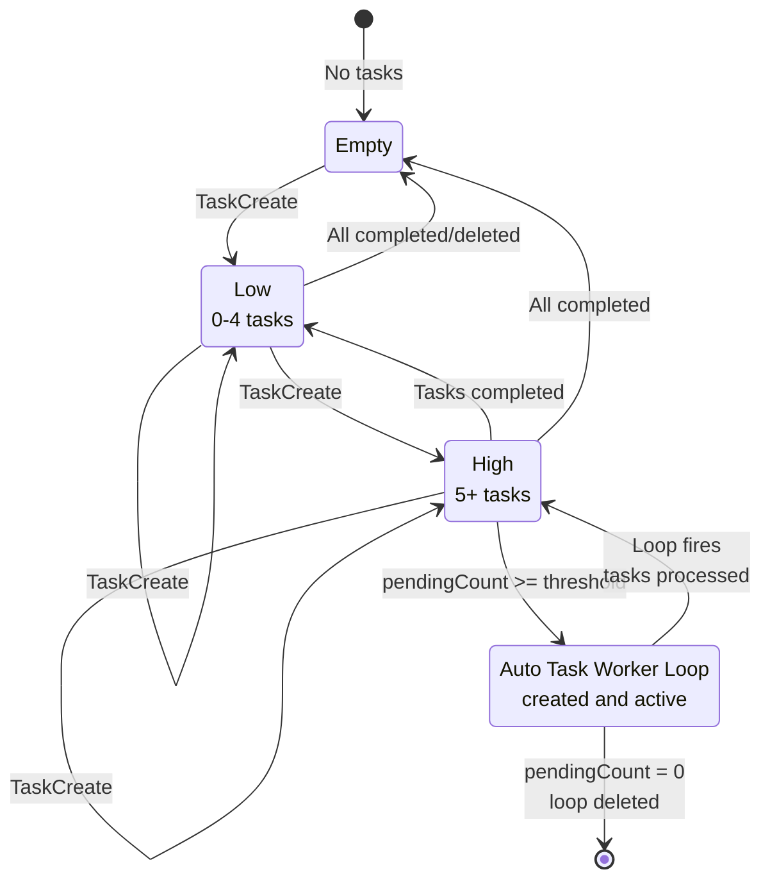

## Coordinator Pattern

The TaskBacklogRuntime uses a Coordinator to manage backlog state:

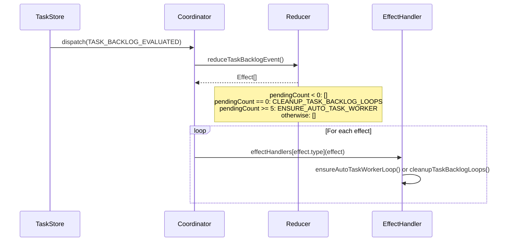

## Threshold Constants

| Constant | Value | Location |
|----------|-------|----------|
| `AUTO_TASK_WORKER_THRESHOLD` | 5 | `src/runtime/task-backlog-runtime.ts` |
| `AUTO_TASK_WORKER_MAX_FIRES` | 30 | `src/runtime/task-backlog-runtime.ts` |
| `AUTO_TASK_WORKER_CRON` | `*/5 * * * *` | `src/runtime/task-backlog-runtime.ts` |
| `AUTO_TASK_WORKER_DEBOUNCE` | 30000ms | `src/runtime/task-backlog-runtime.ts` |

## Task Loop Identification

Backlog loops can be identified by their properties:

```typescript
// src/runtime/task-backlog-runtime.ts
function isAutoTaskWorkerLoop(entry: LoopEntry): boolean {
  return entry.status === "active"
    && entry.prompt === AUTO_TASK_WORKER_PROMPT
    && triggerHasEventSource(entry.trigger, "tasks:created");
}

function isTaskBacklogLoop(entry: LoopEntry): boolean {
  return entry.status === "active"
    && triggerHasEventSource(entry.trigger, "tasks:created")
    && (entry.taskBacklog === true || isAutoTaskWorkerLoop(entry));
}
```

These functions are used for:
- `findAutoTaskWorkerLoop()`: Find existing worker to avoid duplicates
- `cleanupTaskBacklogLoops()`: Delete all backlog loops when queue empties
- `maybeBootstrapTaskLoop()`: Immediate wake when pending tasks exist at creation

## Bootstrap Behavior

When an auto task worker loop is created and pending tasks already exist:

```mermaid
sequenceDiagram
    participant A as TaskBacklogRuntime
    participant T as TaskRuntime
    participant N as NotificationRuntime
    participant P as pi

    A->>T: maybeBootstrapTaskLoop(entry)
    T->>T: hasPendingTasks()
    T->>T: pendingCount > 0?

    alt Yes, pending tasks exist
        T->>N: queueOrDeliverNotification({
            loopId: entry.id,
            prompt: entry.prompt,
            timestamp: Date.now()
        })
        N->>P: pi.sendMessage(triggerTurn: true)
        Note over P: Agent immediately wakes
    else No pending tasks
        Note over T: Skip bootstrap
        Note over T: Wait for tasks:created event
    end
```

## Cleanup Flow

When all tasks are completed:

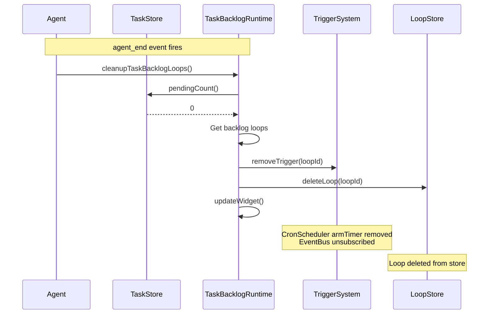

## pi-tasks Integration

When pi-tasks is present, task creation from loops uses RPC:

```mermaid
sequenceDiagram
    participant L as Loop fires
    participant R as TaskRuntime
    participant E as pi.events
    participant PT as pi-tasks

    L->>R: autoCreateTask(entry)
    R->>E: emit(tasks:rpc:create, {
        requestId: uuid,
        subject: entry.prompt.slice(0, 80),
        description: `Auto-created from loop #${entry.id}`,
        metadata: { loopId, trigger }
    })
    E-->>PT: Event delivered
    PT->>PT: Creates task in pi-tasks store
    PT->>E: emit(tasks:rpc:create:reply:uuid, { success, data: { id } })
    E-->>R: Reply received
    R-->>L: Returns taskId
```

### RPC Methods Used

| RPC Event | Purpose |
|-----------|---------|
| `tasks:rpc:ping` | Detect pi-tasks presence |
| `tasks:rpc:create` | Create task from loop |
| `tasks:rpc:pending` | Get pending task count |
| `tasks:rpc:clean` | Prune completed tasks |

## Edge Cases

### 1. Task created while worker loop already exists

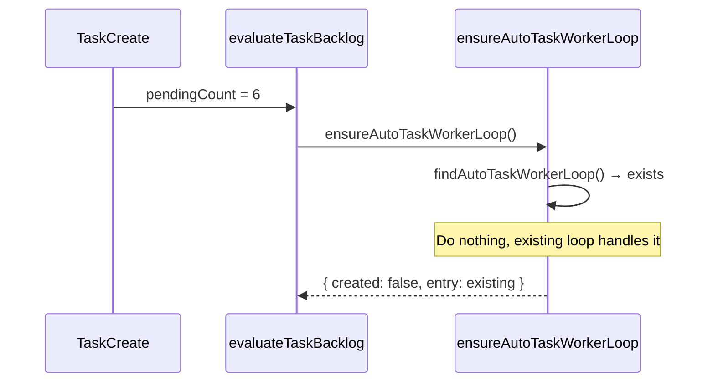

### 2. Multiple tasks created before worker loop created

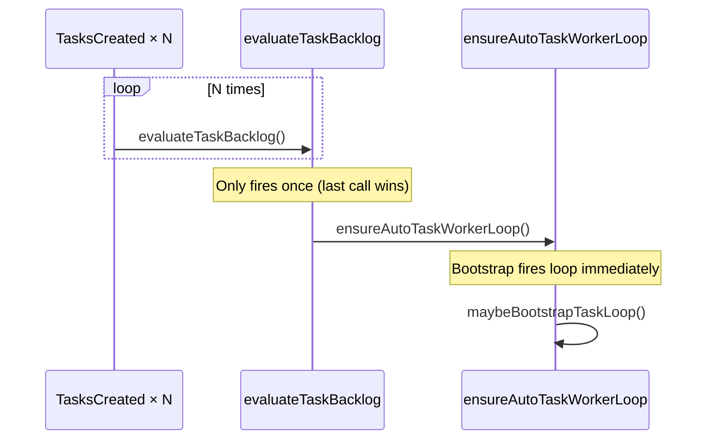

### 3. Worker loop fires but no tasks available

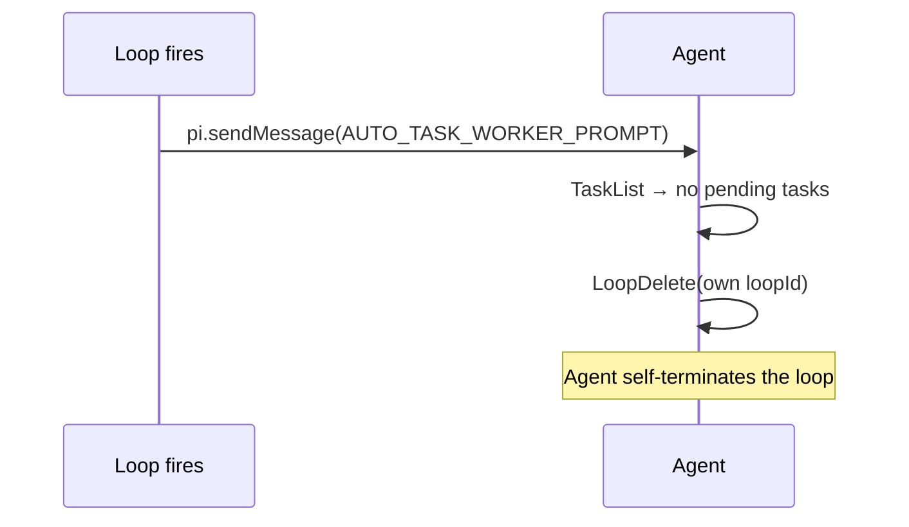

### 4. pi-tasks and native tasks both unavailable

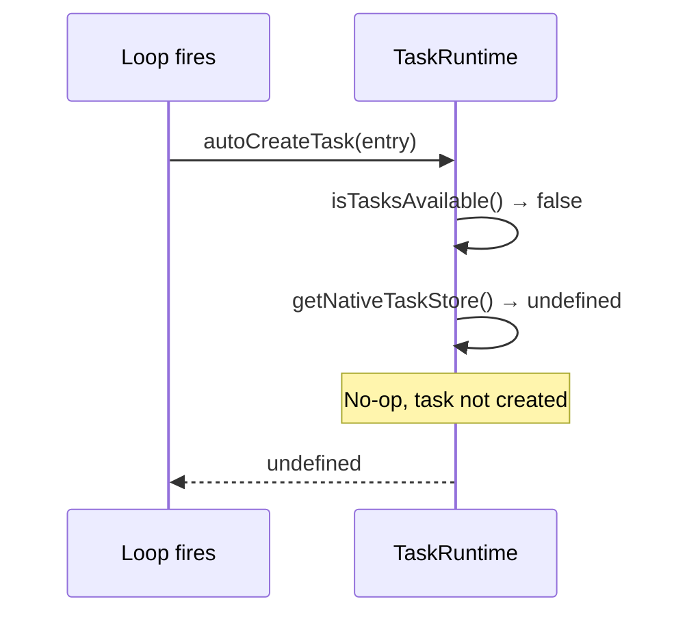

## Relevant Files

| File | Role |
|------|------|
| `src/runtime/task-backlog-runtime.ts` | Auto worker loop lifecycle |
| `src/runtime/task-rpc.ts` | pi-tasks / native task bridge |
| `src/runtime/task-events.ts` | Native task event emission |
| `src/task-backlog-coordinator.ts` | Coordinator reducer |
| `src/task-store.ts` | Native task persistence |
| `src/index.ts` | onLoopFire handler wiring |
| `src/coordinator.ts` | Coordinator pattern implementation |

## Related Flows

- [Auto Task Worker Loop](./auto-task-worker.md)
- [Task Create](./task-create.md)
- [Task Update](./task-update.md)
- [Session Lifecycle](./session-lifecycle.md)
