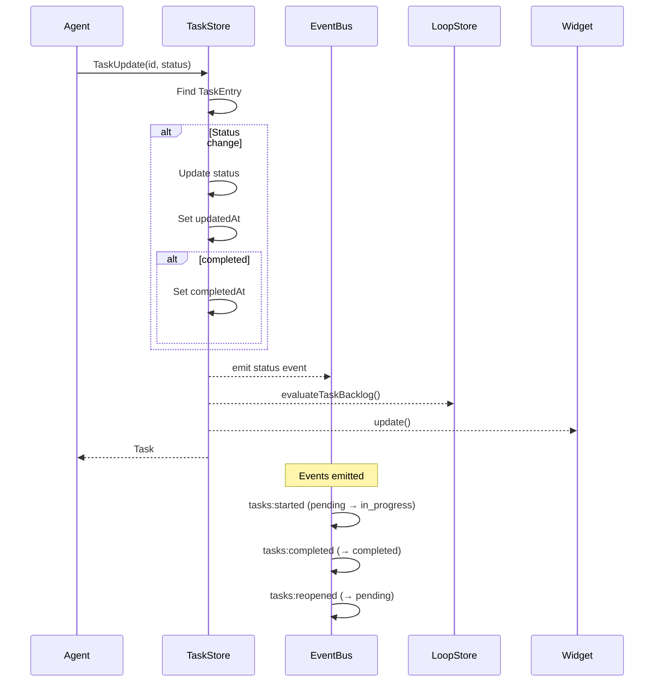
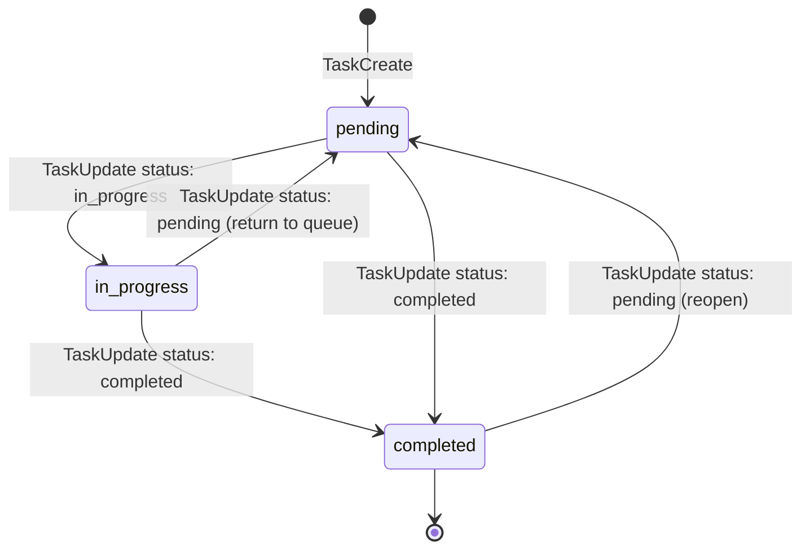
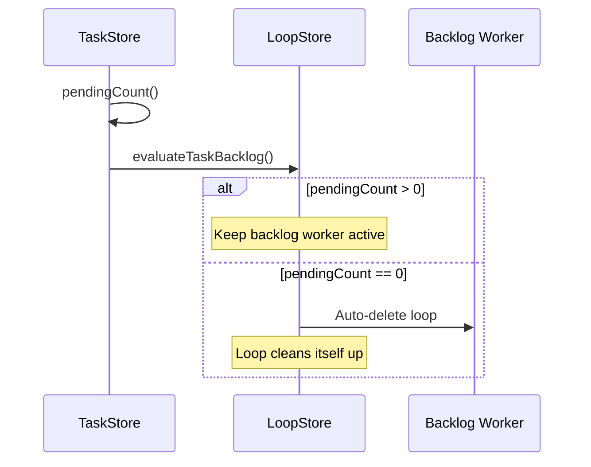

# Task Update

## When to Use

- Starting work on a task (`status: in_progress`)
- Completing a task (`status: completed`)
- Reopening a completed/paused task (`status: pending`)
- Updating task subject or description

## Workflow Diagram



## Status Transitions



## Entry Points

### Via Tool: `TaskUpdate`

1. Agent calls `TaskUpdate` with:
   - `id`: task ID (note: parameter is `id`, not `taskId`)
   - `status`: optional new status
   - `subject`: optional new title
   - `description`: optional new description

2. System:
   - Finds task by ID
   - Applies status change if provided
   - Applies detail changes if provided
   - Emits appropriate event
   - Evaluates backlog
   - Updates widget

3. Returns confirmation or "not found"

### Available Operations

| Operation | Parameters | Event Emitted |
|-----------|------------|---------------|
| Start | `id`, `status: "in_progress"` | `tasks:started` |
| Complete | `id`, `status: "completed"` | `tasks:completed` |
| Reopen | `id`, `status: "pending"` | `tasks:reopened` |
| Update details | `id`, `subject` and/or `description` | `tasks:updated` |

## Data Structure

```typescript
// src/task-types.ts
interface TaskEntry {
  id: string;
  subject: string;
  description: string;
  status: "pending" | "in_progress" | "completed";
  createdAt: number;
  updatedAt: number;          // Updated on any change
  completedAt?: number;      // Set when status → completed
  metadata?: Record<string, unknown>;
}
```

## Common Patterns

### Starting Work

```typescript
// Agent picks up a task
TaskUpdate({
  id: "1",
  status: "in_progress"
})
```

### Completing Work

```typescript
// Agent finishes a task
TaskUpdate({
  id: "1",
  status: "completed"
})
```

### Updating Details

```typescript
// Agent clarifies task
TaskUpdate({
  id: "1",
  subject: "Updated subject",
  description: "More detailed description"
})
```

## Backlog Evaluation

After status changes:



## Important Parameter Name

> **Note**: The parameter is `id`, NOT `taskId`. Using the wrong parameter name will cause a validation error.

```typescript
// ✅ Correct
TaskUpdate({ id: "1", status: "completed" })

// ❌ Wrong - will fail
TaskUpdate({ taskId: "1", status: "completed" })
```

## Relevant Files

| File | Purpose |
|------|---------|
| `src/task-store.ts` | TaskStore.start(), complete(), reopen(), updateDetails() |
| `src/task-types.ts` | TaskEntry structure |
| `src/tools/native-task-tools.ts` | TaskUpdate tool |
| `src/runtime/task-events.ts` | Event emission |

## Related Flows

- [Task Create](./task-create.md)
- [Task List](./task-list.md)
- [Task Delete](./task-delete.md)
